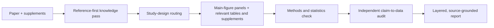

# Medical Paper Analysis AI Context

**A portable, reference-first instruction and knowledge pack for rigorous biomedical paper analysis with AI.**


**[View the worked 60-panel sample analysis →](medical-paper-analysis-ai-context 2/sample_output/uPAR_CAR_T_whole_paper_analysis_sample.md)**

Most AI paper summaries begin with the abstract and follow the authors' narrative. This project gives an AI a stricter workflow: establish the relevant prior knowledge first, inspect the actual figures and methods, identify the true experimental unit, and test whether each major claim is justified by the data.

It is an **AI context pack**, not a standalone application. There is nothing to install or run. Give the Markdown files to an AI assistant that can read attachments or project files, provide the paper and supplements, and ask for an analysis.

[Quick start](#quick-start) · [What it changes](#what-it-changes) · [Workflow](#analysis-workflow) · [Worked example](#worked-example) · [Repository map](#repository-map)

## Quick Start

### 1. Download the repository

Use GitHub's **Code → Download ZIP** option and unzip it, or clone the repository normally. Keep the directory structure intact.

### 2. Load the full context bundle

Give the complete folder to an AI assistant that can read project files. If the platform accepts only individual files, upload all 16 Markdown files.

Markdown alone is sufficient for the runtime instructions. To display and inspect the worked example as designed, also preserve `sample_output/assets/`, which contains its 60 panel crops.

`README.md` is human-facing project orientation. The AI should begin with `00_READ_ME_FIRST.md`, which routes it to the governing and task-relevant files.

### 3. Attach the paper

Provide:

- The complete paper, preferably as a searchable PDF or HTML article.
- Supplementary figures, tables, methods, and data descriptions when available.
- Any specific question, desired depth, or audience level.

### 4. Use this starter request

```text
Before answering, read 00_READ_ME_FIRST.md.
Treat custom_gpt/core_instructions.md as the governing analysis instructions
and use the relevant knowledge modules.

Analyze the attached paper as a whole paper. Build the reference-derived
knowledge base first, analyze every accessible main-figure panel, inspect
relevant supplementary dependencies, and perform an independent claim-to-data
audit. State clearly when a source, panel, value, or method cannot be verified.
```

The AI should read [`00_READ_ME_FIRST.md`](00_READ_ME_FIRST.md) for authority, precedence, and task routing before producing its answer.

## Why This Project?

Biomedical papers are difficult to evaluate because the decisive evidence is distributed across prior references, figure panels, captions, Results prose, Methods, statistics, supplements, and limitations. A fluent summary can still miss the central scientific question: **Do the experiments actually support the conclusion?**

This context pack directs the AI to:

- Build a selective knowledge base from the paper's claim-critical references, verifying sources when lookup is available and labeling the result provisional otherwise.
- Separate established knowledge, inherited methods or datasets, the current paper's new findings, and independent interpretation.
- Route the appraisal by study design instead of applying one generic checklist to every paper.
- Analyze every accessible main-figure panel; examine relevant supplementary dependencies and include supplementary panels when exhaustive analysis is requested.
- Distinguish nominal counts—the displayed observations—from biological `n`, experimental units, repeated measurements, and nested observations.
- Map major author claims to exact experiments and grade the logical strength of the connection.
- State what is missing or unreadable instead of filling gaps with plausible-sounding details.

## What It Changes

| Common paper-summary behavior | This project's required behavior |
|---|---|
| Starts from the abstract's framing | Starts with a selective reference-derived knowledge pass |
| Treats the paper as scientifically self-contained | Identifies inherited mechanisms, models, datasets, and methods |
| Describes a multi-panel figure in one paragraph | Audits each accessible panel or inseparable panel group |
| Treats every plotted point as an independent replicate | Identifies biological `n`, experimental unit, pairing, clustering, and nesting |
| Repeats captions or Results prose | Separates visual observation, caption description, Results narrative, and independent interpretation |
| Lists significant `p` values | Examines effect direction, uncertainty, model/test fit, multiplicity, and practical meaning |
| Accepts the authors' conclusion | Builds a claim-to-data matrix and rewrites overclaims more defensibly |
| Guesses around missing information | Marks unavailable, unreadable, or unreported information explicitly |

## Analysis Workflow



In plain text: source paper → prior-knowledge check → design-specific appraisal → panel-level evidence extraction → methods/statistics check → claim audit → final report.

### Reference-first knowledge pass

The AI identifies the small set of claim-critical references carrying the paper's central logic: foundational mechanism, inherited assay or model, prior therapeutic evidence, reused dataset, clinical context, and important contradiction or limitation. It verifies them when lookup is available and labels the knowledge base provisional when it is not. It then separates:

1. What was established before the paper.
2. What the paper inherits, reuses, or extrapolates.
3. What the paper newly demonstrates.
4. What remains unsupported.

### Study-design routing

The knowledge modules cover:

- Randomized and interventional clinical trials.
- Cohort, case-control, and cross-sectional studies.
- Systematic reviews and meta-analyses.
- Mechanistic, translational, animal, organoid, and cell studies.
- Diagnostic, prognostic, and other specialized designs through the core router.

### Integrated panel analysis

For every accessible main-figure panel or inseparable panel group, the analysis keeps the source evidence and audit together. Relevant supplementary dependencies are cited, and supplementary panels are added when the user requests exhaustive analysis.

Each integrated row contains:

- Panel identity and a content-preserving crop.
- Located legend paraphrase and located corresponding Results paraphrase.
- A brief key quotation when useful and permitted.
- Design/readout, groups, controls, biological `n`, and experimental unit.
- Statistics, exact readable result, inferential support, and key limitation.

The project explicitly rejects a separate source-map table detached from the analysis. See the [exact table schema and panel checklist](knowledge/07_figure_table_analysis.md).

### Independent evidence audit

Major claims are reconstructed as:

```text
author claim
→ exact supporting data
→ directness
→ logical sufficiency
→ weakest link
→ more defensible conclusion
→ confidence
```

This exposes inferential jumps from observation to mechanism, disease relevance, or clinical implication.

## Worked Example

The repository includes a worked sample analysis within its stated scope:

> *A convergent uPAR-positive tumor ecosystem creates broad vulnerability to CAR T cell therapy*

[Open the sample analysis](sample_output/uPAR_CAR_T_whole_paper_analysis_sample.md)

The sample demonstrates:

- A focused backward citation trace and inherited-versus-new knowledge ledger.
- A plain-language overview followed by technical depth.
- Seven integrated figure-analysis tables covering 60 source-panel crops.
- Located figure legends and corresponding Results passages.
- Selected brief key quotations alongside source-grounded paraphrases.
- Biological-replicate, unit-of-analysis, control, and statistics checks.
- Figure-level verdicts and a paper-level independent evidence audit.
- Explicit separation of strong preclinical evidence from unproven clinical claims.

The sample is a **format and rigor reference**, not a factual source for other papers.

## Repository Map

```text
.
├── README.md
├── 00_READ_ME_FIRST.md
├── custom_gpt/
│   └── core_instructions.md
├── knowledge/
│   ├── 00_index.md
│   ├── 01_paper_analysis_workflow.md
│   ├── 02_study_design_router.md
│   ├── 03_clinical_trial_appraisal.md
│   ├── 04_observational_study_appraisal.md
│   ├── 05_systematic_review_meta_analysis.md
│   ├── 06_basic_science_mechanistic_appraisal.md
│   ├── 07_figure_table_analysis.md
│   ├── 08_methods_statistics_glossary.md
│   ├── 09_reference_tracing_strategy.md
│   ├── 10_output_templates.md
│   └── 11_common_failure_modes.md
└── sample_output/
    ├── uPAR_CAR_T_whole_paper_analysis_sample.md
    └── assets/upar_car_t/
        └── Figure_1 ... Figure_7
```

### Core files

| Path | Role |
|---|---|
| [`00_READ_ME_FIRST.md`](00_READ_ME_FIRST.md) | AI entry point, authority, precedence, and task routing |
| [`custom_gpt/core_instructions.md`](custom_gpt/core_instructions.md) | Governing behavior, output structure, grounding, and safety rules |
| [`knowledge/01_paper_analysis_workflow.md`](knowledge/01_paper_analysis_workflow.md) | End-to-end whole-paper workflow |
| [`knowledge/02_study_design_router.md`](knowledge/02_study_design_router.md) | Routes the paper to the correct appraisal framework |
| [`knowledge/07_figure_table_analysis.md`](knowledge/07_figure_table_analysis.md) | Detailed panel-level evidence-analysis standard |
| [`knowledge/09_reference_tracing_strategy.md`](knowledge/09_reference_tracing_strategy.md) | Selective backward/forward reference strategy |
| [`knowledge/10_output_templates.md`](knowledge/10_output_templates.md) | Reusable report structures |
| [`knowledge/11_common_failure_modes.md`](knowledge/11_common_failure_modes.md) | Final quality-control checklist |

## Using A Smaller Context

If an AI cannot accept the entire folder, start with this compact whole-paper set:

1. `00_READ_ME_FIRST.md`
2. `custom_gpt/core_instructions.md`
3. `knowledge/01_paper_analysis_workflow.md`
4. `knowledge/07_figure_table_analysis.md`
5. `knowledge/09_reference_tracing_strategy.md`

Then add one relevant design module from `knowledge/03` through `knowledge/06` when applicable. Include `knowledge/02_study_design_router.md` when the design is unclear or falls outside those four modules.

The loader already selects only relevant available modules; keep `custom_gpt/core_instructions.md` governing. Add the worked sample when the model needs a formatting example. Add the methods/statistics glossary, output templates, and failure modes when context capacity permits.

## Scope And Limitations

- This repository supplies instructions and examples; it does not provide an LLM, retrieval engine, PDF parser, or user interface.
- Analysis quality still depends on the model, source accessibility, figure resolution, and completeness of supplementary material.
- Reference verification may require internet or database access.
- The worked example does not guarantee equal depth when a source is incomplete or inaccessible.
- AI output can contain errors. Important scientific or clinical judgments require checking against the original sources and appropriate domain expertise.
- This project supports evidence interpretation and education. It does not provide diagnosis, treatment selection, or personal medical advice.

## Related Projects

This repository focuses on **how an AI should appraise one biomedical paper**, rather than implementing a research runtime. Conceptually adjacent open-source projects include:

- [PaperQA2](https://github.com/Future-House/paper-qa) — scientific-document question answering with cited retrieval.
- [STORM](https://github.com/stanford-oval/storm) — sourced, multi-perspective topic research and report generation.
- [GPT Researcher](https://github.com/assafelovic/gpt-researcher) — autonomous research across web and local sources.
- [data-to-paper](https://github.com/Technion-Kishony-lab/data-to-paper) — traceable AI-assisted scientific research from data to manuscript.

They demonstrate adjacent approaches to scientific retrieval, synthesis, and traceability. This repository is independent and is not affiliated with them.

## Contributing

Issues and pull requests are welcome for:

- New or improved study-design appraisal modules.
- Stronger checks for figures, statistics, causal claims, and experimental units.
- Corrections to the worked sample.
- Additional fully sourced sample analyses.
- Improvements that make the instructions clearer without weakening evidence standards.

Please keep runtime guidance separate from development notes, preserve source-grounding rules, and avoid adding generated simulator reports to the AI-facing bundle.

## License

This repository does not currently include a license. Before publishing it for reuse or redistribution, add the license that reflects the maintainers' intended terms. Without an explicit license, default copyright restrictions apply.
