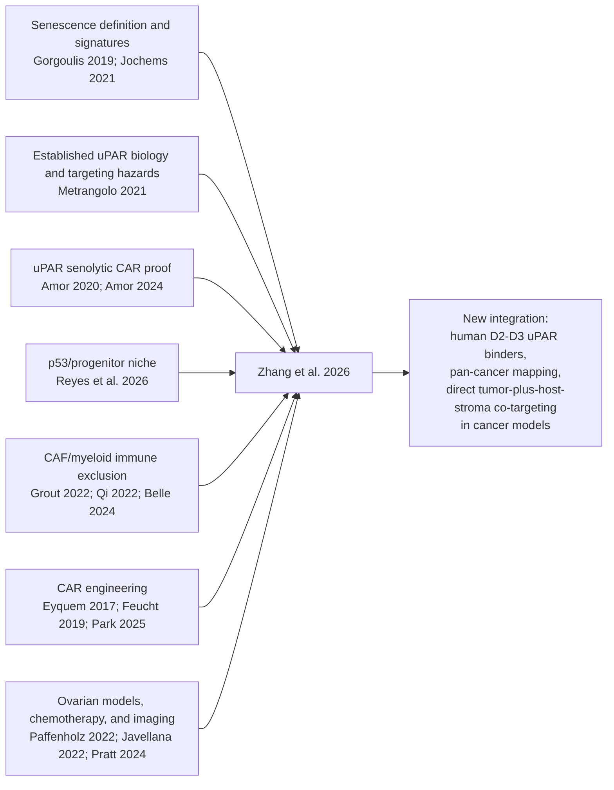
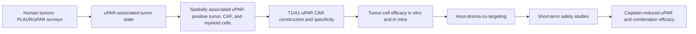

# Worked example: whole-paper analysis

## *A convergent uPAR-positive tumor ecosystem creates broad vulnerability to CAR T cell therapy*

> **Sample status:** Worked reference v0.7 — reference-first analysis with one integrated table per figure, panel images, located legend/Results text, selected key excerpts, detailed evidence auditing, and no reading-recommendations section  
> **Analysis type:** Whole-paper analysis with an Independent Evidence Audit  
> **Scope:** A focused backward citation trace; main article, main figures, methods, embedded supplementary descriptions/captions, limitations, data-availability statement, and declaration of interests. Raw data were not reanalyzed.  
> **Clinical note:** This is a preclinical paper. Nothing in this analysis should be read as a treatment recommendation.

### Paper at a glance

| Item | Details |
|---|---|
| Citation | Zhang Z, Ho Y-J, Fang X, et al. *Cell*. 2026;189(10):2898–2917.e42 |
| Publication date | Published online March 30, 2026; issue date May 14, 2026 |
| DOI | [10.1016/j.cell.2026.03.002](https://doi.org/10.1016/j.cell.2026.03.002) |
| PMID | [41916312](https://pubmed.ncbi.nlm.nih.gov/41916312/) |
| Full text | [PMCID: PMC13372006](https://pmc.ncbi.nlm.nih.gov/articles/PMC13372006/) |
| Study type | Multimodal preclinical translational/mechanistic study |
| Clinical evidence level | No patients received uPAR CAR T cells; efficacy and safety are unproven in humans |

### Independent-audit verdict

Building on earlier same-lineage murine uPAR CAR studies, this paper provides strong preclinical evidence that the new human T1 and A1 products kill uPAR-positive tumor cells on target and can produce durable responses in selected uPAR-expressing mouse models. It also provides credible proof-of-principle that targeting uPAR-positive host stroma can improve tumor control and CAR T-cell infiltration, and that cisplatin can create an experimental treatment state in which uPAR CAR T cells work better.

The data do **not** yet establish that a causal, conserved uPAR-positive “ecosystem” exists in patients, that uPAR CAR T therapy is broadly applicable across unselected solid tumors, or that it is safe in humans. The central safety evidence is short-term and largely hematopoietic; normal human monocytes can be killed ex vivo; and the human CAR does not recognize murine uPAR in ordinary xenografts. The headline is therefore directionally supported as a preclinical concept, but broader than the evidence when read as a clinical claim.

**Most defensible one-sentence conclusion:** Extending an existing murine uPAR-senolytic platform, Zhang et al. show that new human uPAR-directed CARs kill tumor cells on target in selected preclinical solid-tumor models and that uPAR-positive stroma and cisplatin-induced states can be therapeutically exploited; human efficacy, long-term safety, patient-selection thresholds, and the causal tumor–stroma mechanism remain unresolved.

---

## 1. Reference-derived knowledge base

### How this knowledge base was built

Before judging the current paper, I screened its reference list for sources carrying the central logic. I prioritized: the definition and measurement of senescence; the original uPAR CAR work; the proposed p53/progenitor niche; prior tumor-stroma evidence; inherited CAR engineering; reused ovarian models and human datasets; and the imaging or soluble-biomarker claims. Publication metadata and status were checked against primary journal, PubMed, or PMC records on July 30, 2026.

This is a **focused citation trace**, not a systematic review. It is designed to answer “what did this paper inherit, and what did it actually add?” rather than summarize every cited paper.

### Reference map

### Load-bearing reference ledger

| Reference and role | What the source directly established | How the current paper uses it | Inherited versus new | Transfer risk, contradiction, or dependence | Verification/status |
|---|---|---|---|---|---|
| [Gorgoulis et al., *Cell* 2019](https://doi.org/10.1016/j.cell.2019.10.005) — senescence definition | International consensus emphasized that senescence is heterogeneous and should be identified with multiple features rather than one universal marker | Supports use of p16, arrest, and transcriptomic signatures to describe “senescent-like” cells | The conceptual definition is inherited; the current paper applies it to uPAR-positive tumor and stromal states | p16 or a signature alone cannot prove stable senescence in tissue | Peer-reviewed; PMID [31675495](https://pubmed.ncbi.nlm.nih.gov/31675495/) |
| [Jochems et al., *Cell Reports* 2021](https://doi.org/10.1016/j.celrep.2021.109441) — Cancer SENESCopedia/SENCAN | Profiled 13 cancer cell lines after alisertib or etoposide, developed a cancer-senescence classifier, and showed strong cell-of-origin heterogeneity; the authors could not unambiguously validate the classifier in vivo | Zhang et al. reuse the published expression data to examine treatment-associated `PLAUR` across nine cell lines | The dataset and context-dependence warning are inherited; the `PLAUR` reanalysis is new | Drug-treated cell lines do not show that uPAR is a universal senescence antigen, that RNA becomes sufficient surface protein, or that a tissue signature proves stable senescence | Peer-reviewed, open access; PMID [34320349](https://pubmed.ncbi.nlm.nih.gov/34320349/), PMCID [PMC8333195](https://pmc.ncbi.nlm.nih.gov/articles/PMC8333195/) |
| [Metrangolo et al., *Cancers* 2021](https://doi.org/10.3390/cancers13215376) — established uPAR biology and targeting hazards | Synthesized uPAR’s D1–D3 structure, cleavage and soluble forms, tumor/stromal distribution, role in remodeling and inflammation, species specificity, and baseline normal-compartment expression | Supplies the structural rationale for D2–D3 binders and the pre-existing expectation that uPAR can mark both tumor and stroma | D2–D3 biology and multicompartment targeting logic were anticipated; the current paper adds new human binders and direct therapeutic testing | uPAR is process-associated rather than tumor-specific. Cleaved/soluble forms may create antigen-sink or biomarker problems, and human–mouse specificity separates efficacy from normal-organ toxicology in many models | Peer-reviewed review, open access; PMID [34771541](https://pubmed.ncbi.nlm.nih.gov/34771541/), PMCID [PMC8582577](https://pmc.ncbi.nlm.nih.gov/articles/PMC8582577/) |
| [Amor et al., *Nature* 2020](https://doi.org/10.1038/s41586-020-2403-9) — original uPAR senolytic CAR | Identified uPAR as a senescence-associated surface target and showed murine uPAR CAR T-cell activity in senescent-cell, lung-cancer-combination, and liver-fibrosis mouse models; higher, supratherapeutic tested doses caused transient CRS-like symptoms that were mitigated by dose reduction or IL-6R/IL-1R blockade | Provides the therapeutic premise that uPAR can be attacked with CAR T cells and that senescence-inducing therapy can create a targetable state; the 2026 study also reuses the previously described murine product | The target class, murine CAR, fibrosis targeting, combination logic, and dose-dependent safety warning are inherited; the human D2–D3 binders and broader tumor mapping are new | Same research lineage, so the new murine work is an extension rather than an independent replication. Mouse results do not establish human solid-tumor safety. A 2024 [author correction](https://doi.org/10.1038/s41586-024-07197-3) replaced an inadvertently duplicated Figure 4a control micrograph; the stated conclusions were unchanged | Peer-reviewed; PMID [32555459](https://pubmed.ncbi.nlm.nih.gov/32555459/), PMCID [PMC7583560](https://pmc.ncbi.nlm.nih.gov/articles/PMC7583560/) |
| [Amor et al., *Nature Aging* 2024](https://doi.org/10.1038/s43587-023-00560-5) — persistence and long-term murine tolerability | Reported low-dose murine uPAR CAR persistence for more than 15 months with long-term prophylactic metabolic benefit; therapeutic metabolic effects in already-aged mice were demonstrated over shorter follow-up, without overt toxicity at the tested dose | Supports the expectation that uPAR CARs can persist and that some uPAR-positive normal-state populations can be removed without obvious sustained injury in mice | Long-term murine persistence/prophylaxis and shorter-term therapeutic tolerability are inherited context, not results first shown in the 2026 tumor paper | It uses a murine product and noncancer aging models; it cannot resolve human-organ expression or clinical CAR toxicity | Peer-reviewed, open access; PMID [38267706](https://pubmed.ncbi.nlm.nih.gov/38267706/), PMCID [PMC10950785](https://pmc.ncbi.nlm.nih.gov/articles/PMC10950785/) |
| [Reyes et al., *Cell* 2026](https://doi.org/10.1016/j.cell.2026.03.032) — companion p53/progenitor-niche mechanism | In mouse pancreatic tumorigenesis, single-cell/spatial profiling and perturbations linked KRAS and tumor-suppressive programs to a progenitor-like state; KRAS inhibition collapsed the niche, whereas p53 suppression expanded and stabilized it | Supplies much of the causal biological framing behind “p53-constrained,” “progenitor-like,” and “tumor-maintaining ecosystem” language | The causal p53/KRAS niche mechanism comes from this companion study; the uPAR paper mainly tests association with an analogous state across human cancers and therapeutic targeting | Same research group, same issue, and predominantly mouse PDAC: it is mechanistic support, not independent pan-cancer validation. The advanced human states are analogous, not lineage-proven continuations | The current paper cites the 2025 bioRxiv version, but it has been superseded by the final *Cell* article; PMID [41990751](https://pubmed.ncbi.nlm.nih.gov/41990751/), PMCID [PMC13173668](https://pmc.ncbi.nlm.nih.gov/articles/PMC13173668/) |
| [Grout et al., *Cancer Discovery* 2022](https://doi.org/10.1158/2159-8290.CD-21-1714), [Qi et al., *Nature Communications* 2022](https://doi.org/10.1038/s41467-022-29366-6), and [Belle et al., *Cancer Discovery* 2024](https://doi.org/10.1158/2159-8290.CD-23-0428) — stromal context | These studies separately linked a spatially organized FAP-positive/αSMA-positive CAF matrix program—not FAP abundance alone—to T-cell exclusion; co-localized FAP-positive fibroblasts with SPP1-positive macrophages; and functionally implicated senescent, `PLAUR`-enriched myofibroblasts in pancreatic immunosuppression | Provide external plausibility that fibroblast/myeloid neighborhoods can be fibrotic and immunosuppressive | Stromal immune-exclusion biology was already established; the current paper adds uPAR as a shared targeting handle across several compartments | Causality is strongest in mouse PDAC. Human NSCLC/CRC evidence is mainly spatial and correlative; marker overlap does not prove that the exact uPAR-positive populations have the same function | All peer-reviewed and open access: PMC [9633420](https://pmc.ncbi.nlm.nih.gov/articles/PMC9633420/), [8976074](https://pmc.ncbi.nlm.nih.gov/articles/PMC8976074/), and [12155422](https://pmc.ncbi.nlm.nih.gov/articles/PMC12155422/) |
| [Eyquem et al., *Nature* 2017](https://doi.org/10.1038/nature21405), [Feucht et al., *Nature Medicine* 2019](https://doi.org/10.1038/s41591-018-0290-5), and [Park et al., *JCO* 2025](https://doi.org/10.1200/JCO-24-02424) — TRAC and 1XX engineering | CAR knock-in at `TRAC` improved regulated expression in preclinical CD19 models; 1XX signaling improved persistence/function in preclinical CD19 CARs; a 28-patient phase I CD19-1XX study later reported clinical activity and relatively low severe CRS/ICANS rates | Provides the rationale for `TRAC` disruption and the 1XX module used in the humanized and persistence experiments | `TRAC` editing and 1XX are inherited technologies; their application to uPAR is new | Zhang disrupts `TRAC` and then delivers the CAR by retrovirus—it does **not** knock the CAR into `TRAC`, so Eyquem’s endogenous-promoter expression benefit cannot be imported. Clinical evidence is for CD19 lymphoma, not uPAR solid tumors | Peer-reviewed: PMCID [PMC5558614](https://pmc.ncbi.nlm.nih.gov/articles/PMC5558614/), [PMC6532069](https://pmc.ncbi.nlm.nih.gov/articles/PMC6532069/), and [PMC12270773](https://pmc.ncbi.nlm.nih.gov/articles/PMC12270773/) |
| [Paffenholz et al., *PNAS* 2022](https://doi.org/10.1073/pnas.2117754119) — ovarian EPO-GEMM and cisplatin response | Developed genetically controlled ovarian models and showed that chemotherapy-induced senescence differed by genotype and influenced therapeutic response | Supplies the MP/MPB1 ovarian models and the cisplatin/senescence rationale | The model and core senescence-response relationship are inherited; combining them with the new uPAR products is the extension | Reuse is valuable but not independent replication of model behavior; the causal role of uPAR in the new combination still needs mediation testing | Peer-reviewed, open access; PMID [35082152](https://pubmed.ncbi.nlm.nih.gov/35082152/), PMCID [PMC8812522](https://pmc.ncbi.nlm.nih.gov/articles/PMC8812522/) |
| [Javellana et al., *Cancer Research* 2022](https://doi.org/10.1158/0008-5472.CAN-21-1467) — human pre/post chemotherapy dataset | In 20 paired pre/post RNA-seq sample sets from 20 patients with advanced HGSOC (40 specimens), neoadjuvant carboplatin/paclitaxel produced broad transcriptomic remodeling and reduced cell-cycle programs among other changes | The current paper reanalyzes these paired samples to show increased `PLAUR` and lower cell-cycle scores | The patient cohort and RNA data are reused; the `PLAUR`-focused analysis is new | Bulk RNA cannot localize `PLAUR` to malignant cells. More importantly, Zhang labels the cohort “pre/post cisplatin,” but the source reports carboplatin plus paclitaxel; exceptional responders without enough residual tumor were excluded | Peer-reviewed, open access; PMID [34737212](https://pubmed.ncbi.nlm.nih.gov/34737212/), PMCID [PMC8936832](https://pmc.ncbi.nlm.nih.gov/articles/PMC8936832/) |
| [Pratt et al., *Journal of Nuclear Medicine* 2024](https://doi.org/10.2967/jnumed.124.268278) — uPAR immuno-PET | Developed murine and human uPAR antibody PET agents and showed treatment-associated uptake changes in pancreatic models | Supplies technical and biological precedent for the paper’s uPAR PET experiments | uPAR immuno-PET is inherited; use for longitudinal response monitoring in the current ovarian model is an extension | Prior work was preclinical, noted antibody specificity/cross-reactivity issues, and did not establish clinical diagnostic performance | Peer-reviewed, open access; PMID [39362768](https://pubmed.ncbi.nlm.nih.gov/39362768/), PMCID [PMC11533913](https://pmc.ncbi.nlm.nih.gov/articles/PMC11533913/) |
| [Rasmussen et al., *Frontiers in Immunology* 2021](https://doi.org/10.3389/fimmu.2021.780641) and related noncancer uPAR literature — biomarker limitation | Reviews evidence that circulating suPAR rises with immune activation and is nonspecifically associated with multiple inflammatory diseases; other cited studies associate it with kidney injury | Qualifies the proposal that suPAR could monitor tumor burden or response | suPAR’s inflammatory context was known before this paper | A falling suPAR level can track a controlled xenograft yet remain nonspecific in patients with cancer, infection, tissue injury, or fibrosis | Peer-reviewed, open access; PMID [34925360](https://pubmed.ncbi.nlm.nih.gov/34925360/), PMCID [PMC8674945](https://pmc.ncbi.nlm.nih.gov/articles/PMC8674945/) |

### What was known before this paper

- uPAR had already been identified as a senescence-associated surface target, and uPAR CAR T cells had already shown efficacy in murine senescence, fibrosis, and combination-treatment models.
- Long-lasting murine CAR persistence and tolerability at selected doses had already been reported.
- uPAR’s cleavage, soluble forms, tumor/stromal distribution, species specificity, and normal-tissue targeting hazards were already recognized.
- Fibroblast and myeloid programs had already been linked to desmoplasia, immune exclusion, and immunosuppression.
- The p53/KRAS progenitor-niche mechanism was developed in a same-team companion mouse-PDAC study.
- The 1XX signaling module and `TRAC` engineering strategy had already been developed for CD19-directed CARs.

### What is inherited or reused directly

- The murine uPAR CAR used again here had already been described by the same research lineage; its new applications are extensions, not independent rediscovery.
- The MP/MPB1 ovarian EPO-GEMM platform, tumor-derived cell lines, and genotype-specific cisplatin/senescence logic come from Paffenholz et al.
- The 20-pair human ovarian RNA cohort comes from Javellana et al.; Zhang et al. add a post hoc `PLAUR`-focused analysis.
- The Jochems expression dataset, 1XX intracellular design, `TRAC`-disruption method, murine uPAR PET reagent, and imaging precedent are reused or adapted.
- The Reyes companion paper supplies much of the p53-constrained progenitor-niche mechanism used to interpret the human associations.

### What this paper newly contributes

- Cross-cancer integration of `PLAUR`/uPAR RNA, protein, single-cell, and spatial evidence.
- Two human D2–D3 uPAR binders, T1 and A1, with antigen-dependent CAR activity.
- Quantitative antigen-density mapping across 71 cancer cell lines and a proposed activity threshold.
- Efficacy testing across a large selected panel of uPAR-expressing CDX, PDX, PDO-derived, orthotopic, metastatic, syngeneic, autochthonous, and humanized systems.
- Direct proof-of-principle that species-separated tumor and host-stromal uPAR targeting can add benefit in xenografts.
- Small ex vivo demonstrations that one human product can recognize tumor, CAF, and myeloid populations from primary specimens.
- Short-term assessment of human hematopoietic lineages after uPAR CAR activity in a humanized model.

### What remains unsupported by the reference base and the current paper

- That the human uPAR-positive tumor–stroma ecosystem is causal and conserved across cancers.
- That the proposed antigen-density threshold prospectively selects patients.
- That one human product can safely remodel an intact human tumor and stroma in vivo.
- That cisplatin’s combination benefit is mediated specifically by senescence-induced uPAR.
- That uPAR CAR T therapy is broadly safe or effective in patients.

---

## 2. Plain-language overview

CAR T cells are immune cells engineered to recognize a protein on the surface of a target cell. They have transformed treatment of some blood cancers, but solid tumors are harder: the target protein may be unevenly expressed, immune cells may struggle to enter the tumor, and fibroblasts or suppressive myeloid cells can form a protective neighborhood around cancer cells.

This is **not the first uPAR CAR T-cell study**. Earlier work from the same research lineage identified uPAR as a senescence-associated target, built a murine uPAR CAR, and tested it in mouse senescence, fibrosis, and treatment-combination settings. The current paper’s main advance is to integrate that foundation into solid-tumor development: it maps uPAR across tumor and stromal compartments, introduces two human D2–D3 binders, T1 and A1, and tests tumor-cell plus stromal targeting across a broad preclinical model panel.

The new human products kill uPAR-positive cancer cells, while genetically uPAR-negative cells resist killing. In multiple mouse models, the CAR T cells shrink or clear selected uPAR-expressing tumors, including disseminated ovarian tumors. Reuse of the earlier mouse CAR suggests that removing uPAR-positive host stroma can improve infiltration and tumor control. Finally, cisplatin raises uPAR in tested experimental models and improves CAR efficacy. A reused human ovarian RNA cohort supports a treatment-associated rise in `PLAUR`, but that cohort received carboplatin plus paclitaxel rather than cisplatin alone.

The work is an ambitious preclinical package, but it is not a clinical trial. Only a minority of surveyed tumors had uPAR on most tumor cells, the detailed spatial-transcriptomic analysis came from one pancreatic tumor, and the safety models cannot rule out delayed toxicity or injury to human organs in inflammatory or wound-healing settings.

---

## 3. What the paper is asking

### Central question

Can uPAR function as a cross-tumor, cell-state-based CAR T target that exposes both malignant cells and their fibrotic or immunosuppressive support cells, producing durable antitumor activity without unacceptable normal-tissue or hematopoietic toxicity?

### Operational subquestions

1. How common is uPAR expression across human solid tumors, and what molecular programs accompany it?
2. Are uPAR-positive tumor cells spatially associated with uPAR-positive fibroblasts and myeloid cells?
3. Are the new T1 and A1 human uPAR CARs truly antigen-dependent?
4. Do the CARs control primary, residual, and metastatic tumors in several preclinical systems?
5. Does targeting uPAR-positive host stroma add benefit beyond targeting tumor cells?
6. Can chemotherapy-induced senescence or stress increase uPAR and sensitize tumors?
7. What do the available models show—and fail to show—about toxicity?

### Paper logic

The first two links are mainly observational. The CAR specificity and model efficacy links are experimental. The final move from model efficacy to broad clinical vulnerability remains a translational hypothesis.

---

## 4. Required background concepts

| Term | Meaning in this paper |
|---|---|
| **uPAR / CD87** | Urokinase plasminogen activator receptor, a cell-surface protein involved in pericellular proteolysis, matrix remodeling, migration, inflammation, and wound healing. It is better treated as process-associated than tumor-specific and can occur in normal immune and remodeling tissues. |
| **`PLAUR`** | The gene encoding uPAR. RNA abundance is not equivalent to membrane uPAR on tumor cells because RNA may come from stromal cells and does not directly measure accessible protein density. |
| **suPAR** | Soluble uPAR released after cleavage. It may track tumor burden in a model, but inflammation and fibrosis can also elevate it. |
| **CAR T cell** | A T cell engineered with an antibody-derived binding domain and intracellular activation domains. |
| **T1 and A1** | Two independently obtained human uPAR-binding domains used in the study’s CARs. They bind the D2–D3 region of uPAR. |
| **D2–D3** | A region that can remain membrane-associated after proteolytic loss of D1, making it an attractive target. Cleaved and soluble uPAR forms can still complicate target measurement and tracer or CAR pharmacology. |
| **28ζ CAR** | A CAR using CD28 costimulation and CD3ζ activation. |
| **1XX CAR** | A CD3ζ design with two of three ITAMs inactivated, intended to moderate signaling and improve persistence. |
| **Antigen density** | Number of target molecules on a cell. The study estimates robust in vitro activity above roughly 1,500 uPAR molecules per cell, but this is not a clinically validated cutoff. |
| **Tumor microenvironment (TME)** | Nonmalignant cells and matrix around the tumor, including immune cells, fibroblasts, vessels, and extracellular matrix. |
| **CAF** | Cancer-associated fibroblast; often involved in fibrosis and altered immune-cell access. |
| **Myeloid suppressor populations** | Monocytes, macrophages, neutrophil-like cells, and myeloid-derived suppressor cells that can inhibit antitumor immunity in some contexts. |
| **EMT** | Epithelial-to-mesenchymal transition, a plasticity program associated with invasion and loss of epithelial markers. |
| **Senescent-like state** | A growth-arrested, stress-associated state inferred here from signatures, p16, and other markers. These measurements do not prove a complete or irreversible senescence program. |
| **Ecosystem targeting** | Targeting both malignant cells and nonmalignant cells thought to support them. |
| **CDX / PDX / PDO** | Cell-line-derived xenograft, patient-derived xenograft, and patient-derived organoid. Xenografts usually require immunodeficient mice. |
| **Syngeneic model** | Mouse tumor and host have a compatible genetic background, allowing an intact murine immune system. |
| **Humanized mouse** | An immunodeficient mouse partly reconstituted with human hematopoietic cells. It does not reproduce an entire human immune system or human organ expression. |
| **TRAC editing** | Disruption of the native T-cell receptor locus, used here to reduce xenogeneic T-cell responses. The CAR is then delivered by retrovirus; this is not CAR knock-in at `TRAC`. |
| **PanCK** | Pan-cytokeratin, used to identify epithelial tumor cells. Tumor cells that complete EMT may lose it and be misclassified as stroma. |

---

## 5. Study design and evidence level

This is not one experiment. It is a linked evidence package with different strengths and experimental units.

| Evidence layer | Main material | What it can establish | Main constraint |
|---|---|---|---|
| Human bulk genomics/transcriptomics | More than 10,000 tumors; TCGA analysis reported at `n=10,071` | Cross-cancer association of `PLAUR` with mutations and transcriptional programs | Bulk RNA mixes tumor and stromal signals; observational |
| Human protein imaging | About 1,070 tumors by multiplex IF | Prevalence and distribution of uPAR-positive cells in sampled tissue | Thresholds are study-defined; tissue cores can miss heterogeneity |
| Human single-cell datasets | Liver `n=79`, lung `n=9`, ovarian `n=41`, pancreatic `n=16` patients in the principal comparison | Cell-type-resolved associations | Uneven cohorts; cells are nested within patients |
| Spatial discovery | One treatment-naive pancreatic ductal adenocarcinoma specimen/section | Detailed local co-occurrence patterns | No patient-level replication for the discovery map |
| Multicancer hyperplex IF | PDAC `n=101`, LUAD `n=55`, LUSC `n=49`, colorectal adenocarcinoma `n=137`, mucinous colorectal cancer `n=51`; more than 3.5 million cells | Recurrence of marker-defined cellular associations across cases | Correlation and proximity do not prove functional support |
| In vitro specificity | Two binders, multiple T-cell donors, cancer-cell panel, `PLAUR`-knockout controls | Antigen dependence and approximate antigen-density relationship | Cell culture does not reproduce tumor architecture or toxicity |
| Ex vivo primary tissue | Dissociated HGSOC `n=4` and LUAD `n=1`; small CAF/macrophage cohorts | Ability to kill several human primary uPAR-positive cell populations | Very small samples; 16-hour assay; tissue architecture removed |
| Mouse efficacy | CDX, PDX, PDO-derived, orthotopic, metastatic, syngeneic, autochthonous, and humanized systems | Preclinical efficacy across several model classes | Selected models; species differences; many use immunodeficient hosts |
| Mouse safety | Murine CAR in immunocompetent models; human CAR in humanized mice | Short-term overt and hematopoietic toxicity signals | Cannot establish human-organ or delayed clinical safety |

### Overall evidence rating

- **For on-target killing:** strong preclinical evidence.
- **For durable activity in selected uPAR-positive models:** strong preclinical evidence.
- **For a recurring uPAR-positive tumor–stroma spatial pattern:** moderate evidence.
- **For a causal, conserved tumor-supporting ecosystem:** weak evidence.
- **For stromal co-targeting as an added therapeutic mechanism:** moderate proof-of-principle.
- **For cisplatin-enhanced efficacy:** strong model evidence; moderate evidence that uPAR induction or senescence specifically mediates the benefit.
- **For human safety or clinical efficacy:** not established.

---

## 6. Main claims

The paper advances eight linked claims:

1. uPAR marks an aggressive, progenitor/EMT-like cancer state enriched for `TP53` and RAS/MAPK alterations.
2. uPAR-positive tumor, fibroblast, and myeloid cells form a recurring fibrotic, immunosuppressive spatial ecosystem.
3. T1 and A1 uPAR CAR T cells recognize and kill uPAR-positive tumor cells specifically.
4. uPAR CAR T cells produce durable control of several primary, metastatic, and residual-disease models.
5. Targeting uPAR-positive host stroma adds therapeutic benefit and improves CAR T-cell entry.
6. The treatment has a favorable safety profile without sustained myeloid depletion.
7. Senescence-inducing treatment raises uPAR and improves CAR T-cell efficacy.
8. uPAR is therefore a broadly applicable target capable of addressing antigen heterogeneity and stromal exclusion.

Claims 3 and 4 are the best supported. Claims 2 and 7 contain plausible mechanisms but lack decisive causal tests. Claims 6 and 8 require the greatest qualification.

---

## 7. Figure- and table-by-table analysis

**How to read the integrated panel tables:** Each panel-analysis row contains the unaltered panel crop, a located caption/legend paraphrase, the most directly corresponding located Results passage, and the independent evidence audit. A repeated paragraph locator means that one Results passage supports several panels; within each table, a brief excerpt attached to that passage is the shared key quotation for those rows unless a row has its own excerpt. Click a crop to open the complete figure.

### Figure 1 — uPAR distribution and the associated tumor state

**Figure purpose and intended claim:** Establish the prevalence of tumor-cell uPAR and connect high `PLAUR` to a cross-cancer aggressive or progenitor/EMT-like state.

#### Integrated panel analysis

| Panel | Panel image | Figure legend | Corresponding article text | Design and readout | Groups, controls, `n`, and unit | Statistics and exact result | What it supports | Key limitation |
|---|---|---|---|---|---|---|---|---|
| **A** |  | **Caption paraphrase: [Figure 1A](https://pmc.ncbi.nlm.nih.gov/articles/PMC13372006/#F1):** Multiplex IF shows representative human tumor cores; donut plots classify each tumor type by the fraction of uPAR-positive tumor cells. | **Results paraphrase: [P12](https://pmc.ncbi.nlm.nih.gov/articles/PMC13372006/#P12):** The authors use compartment-resolved multi-IF to estimate tumor-cell uPAR prevalence and report that roughly 15% of samples meet their high-expression definition.  **Brief key excerpt:** “high uPAR expression” | Multiplex IF identifies uPAR with tumor markers (PanCK, p53, or MSLN), αSMA-positive fibroblasts, CD45-positive immune cells, and DAPI. Tumors are classified by the percentage of uPAR-positive tumor cells: high `>50%`, intermediate `30–50%`, low `5–30%`, negative `<5%`. | The displayed cohorts are PDAC `137`, CRC `220`, NSCLC `251`, prostate `68`, mesothelioma `9`, sarcoma `49`, bladder `92`, cholangiocarcinoma `8`, brain `74`, ovarian `36`, and breast `130`, summing to `n=1,074`. Patient is generally the biological unit; the caption says tumor for ovarian/bladder. Two to three TMA cores were averaged per patient where available. | Descriptive prevalence; no inferential test is attached to the donut plots. About 15% of the displayed aggregate is high, but small histology cohorts can span 0–100%. | Direct protein-level evidence that tumor-cell uPAR occurs across several histologies but is far from universal. | The Results text says 1,071 tumors, whereas the plotted counts sum to 1,074. Study-defined thresholds are not validated treatment cutoffs. Small and mixed-source cohorts and TMA sampling limit prevalence estimates; PanCK-based or exclusion-based classification can misclassify EMT-shifted carcinoma, brain, or sarcoma cells. |
| **B** |  | **Caption paraphrase: [Figure 1B](https://pmc.ncbi.nlm.nih.gov/articles/PMC13372006/#F1):** TCGA tumors are compared for `PLAUR` expression according to alteration status across 456 cancer-relevant genes. | **Results paraphrase: [P13](https://pmc.ncbi.nlm.nih.gov/articles/PMC13372006/#P13):** The paper interprets higher `PLAUR` in tumors with `TP53`, `KRAS`, and other MAPK-pathway alterations as evidence of shared genetic associations. | TCGA analysis tests whether bulk `PLAUR` differs between altered and wild-type tumors for 456 cancer-relevant genes. The x-axis is `PLAUR` log2 fold-change; the y-axis is `−log10(adjusted p)`; bubble size reflects alteration frequency. | `n=10,071` tumors pooled across cancer types. Mutation/copy-number status is an observational exposure; tumor is the unit and there is no perturbation control. | Wilcoxon testing. `TP53`, `KRAS`, `PIK3CA`, `APC`, `FAT1`, `CDKN2A`, `BRAF`, and `EGFR` alterations associate with higher `PLAUR`; `IDH1` is the strongest negative association. The adjustment procedure is not specified clearly. | High `PLAUR` co-occurs with several oncogenic alteration classes, including RAS/MAPK-associated lesions. | Pan-cancer composition, purity, inflammation, and stroma can confound the associations. Pooling mutations with copy-number events obscures functional direction, and association does not show that any alteration causes uPAR expression. |
| **C** |  | **Caption paraphrase: [Figure 1C](https://pmc.ncbi.nlm.nih.gov/articles/PMC13372006/#F1):** Pathway enrichment contrasts tumors in the upper and lower `PLAUR` tertiles. | **Results paraphrase: [P14](https://pmc.ncbi.nlm.nih.gov/articles/PMC13372006/#P14):** The authors report enrichment of plasminogen, KRAS, EMT, inflammatory, fibrotic, and angiogenic programs in `PLAUR`-high tumors. | Across 19 TCGA cancers, pathway enrichment compares the top versus bottom `PLAUR` tertiles. The x-axis is normalized enrichment score; point size encodes `−log10(FDR)`. | Tumor is the source unit, but the panel presents a cross-cancer summary. Extreme tertiles discard the middle third and amplify contrast. | Permutation testing. Inflammation, EMT, progenitor, SenMayo, KRAS/MAPK, hypoxia, wound-healing, uPAR, fibrosis, and plasminogen programs enrich positively; cell-cycle, mismatch-repair, RNA-degradation, fatty-acid, spliceosome, and oxidative-phosphorylation programs trend negatively. | `PLAUR`-high tumors share a coherent remodeling/plasticity transcriptional pattern. | Bulk RNA mixes malignant and stromal programs. Enrichment is not a direct cell-state measurement; pathway overlap and broad screening create dependence/multiplicity, and the construction of one displayed score per signature from 19 cancers is not fully explained. |
| **D** |  | **Caption paraphrase: [Figure 1D](https://pmc.ncbi.nlm.nih.gov/articles/PMC13372006/#F1):** Cancer-type averages are used to correlate uPAR activity with progenitor and EMT transcriptional signatures. | **Results paraphrase: [P14–P15](https://pmc.ncbi.nlm.nih.gov/articles/PMC13372006/#P14):** The paper treats the correlations as part of a conserved aggressive, progenitor-like and EMT-associated uPAR state, while invoking prior mouse work for mechanistic context. | Across cancer types, uPAR activity scores are correlated with progenitor and EMT scores; each point is one cancer type. | Approximately 19 cancer-type aggregates, not individual patients. | Pearson correlation: progenitor `R=0.525`, `p=0.02`; EMT `R=0.766`, `p<0.001`. | The cross-cancer average with higher uPAR activity also tends to have higher progenitor/EMT activity. | Ecological correlation across tumor-type means cannot establish a patient-level or cell-level relationship. Shared genes or tumor purity may inflate score correlations. |
| **E** |  | **Caption paraphrase: [Figure 1E](https://pmc.ncbi.nlm.nih.gov/articles/PMC13372006/#F1):** Epithelial tumor-cell scRNA-seq from liver, lung, ovarian, and pancreatic cancers compares signature scores between high- and low-`PLAUR` cells. | **Results paraphrase: [P14](https://pmc.ncbi.nlm.nih.gov/articles/PMC13372006/#P14):** The authors say single-cell datasets confirm that `PLAUR`-high malignant cells share conserved transcriptional programs across four cancers. | scRNA-seq epithelial tumor cells are divided into `PLAUR`-high and -low tertiles and compared for plasminogen, wound-healing, EMT, and progenitor scores. The Methods first remove `PLAUR=0` cells, so “low” means low-positive—not uPAR-negative. | Liver `n=79`, lung `n=9`, ovarian `n=41`, and pancreatic `n=16` patients are source cohorts, but violins display cells nested within patients. | Cell-level Wilcoxon tests; all comparisons are `p<0.0001`. | Similar `PLAUR`-associated programs appear inside epithelial compartments in four datasets, reducing the bulk-stroma concern. | Excluding zero-expressing cells changes the estimand and invites dropout/detection-depth bias. Patient-level distributions or mixed models are not shown; large cell counts can create tiny p values without comparable biological replication. |

**Integrated figure verdict**

- **Strongest panel:** A for direct protein-level prevalence across 1,074 specimens; E is the strongest tumor-cell-restricted transcriptomic complement but has exclusion and nesting problems.
- **Weakest inferential link:** Moving from mutation/signature association in B–E to the claim that `TP53` or RAS/MAPK alterations mechanistically create a conserved uPAR-positive state.
- **What Figure 1 establishes:** uPAR is present on tumor cells in subsets of multiple cancers and `PLAUR` associates with remodeling, EMT, progenitor, inflammatory, and fibrotic programs.
- **What it does not establish:** A causal oncogenic circuit, a universal tumor state, or a clinically usable uPAR threshold.
- **Supplementary dependency:** Figure S1 extends the analysis toward metastasis and survival, but its captions use upper/lower tertiles while Methods and Data S1.2 describe a median split; the compared groups cannot be reconstructed confidently without code/data.
- **Claim-support grade:** **Strong descriptive association; moderate for a recurring state; weak for causal control.**
- **More defensible conclusion:** uPAR marks heterogeneous subsets of solid tumors and correlates with aggressive plasticity/remodeling programs; the drivers and treatment-eligible prevalence require prospective validation.

Source: [Figure 1](https://pmc.ncbi.nlm.nih.gov/articles/PMC13372006/#F1), Figure S1, Data S1.1–S1.2.

### Figure 2 — A spatially associated uPAR-positive niche

**Figure purpose and intended claim:** Show that uPAR-positive malignant, fibroblast, and myeloid populations occupy a shared fibrotic and immunosuppressive spatial neighborhood.

#### Integrated panel analysis

| Panel | Panel image | Figure legend | Corresponding article text | Design and readout | Groups, controls, `n`, and unit | Statistics and exact result | What it supports | Key limitation |
|---|---|---|---|---|---|---|---|---|
| **A** |  | **Caption paraphrase: [Figure 2A](https://pmc.ncbi.nlm.nih.gov/articles/PMC13372006/#F2):** Xenium spatial transcriptomics maps cell types in one untreated human PDAC specimen. | **Results paraphrase: [P17](https://pmc.ncbi.nlm.nih.gov/articles/PMC13372006/#P17):** The authors define basal PDAC, `PLAUR`-positive CAF, and `PLAUR`-positive myeloid subpopulations from the targeted spatial dataset. | A 477-gene Xenium assay (377 standard plus 100 custom genes) maps one untreated PDAC. Clustering identifies basal PDAC (`HMGA2`-high/`ANXA10`-low), classical PDAC, `PLAUR+` CAFs (`PDGFRA/B`, `ACTA2`, `SERPINE1`), and `PLAUR+` myeloid cells (`CD68/MRC1`, `SPP1`). | One patient and one profiled specimen; every cell is nested within that specimen. | Descriptive map; no inferential test. | The specimen contains spatially distinct malignant and stromal states suitable for neighborhood analysis. | This is spatial discovery with biological `n=1`, not replicated evidence. Classification depends on a targeted gene panel and study-defined annotation rules. |
| **B** |  | **Caption paraphrase: [Figure 2B](https://pmc.ncbi.nlm.nih.gov/articles/PMC13372006/#F2):** An adjacent H&E section is displayed with spatial `PLAUR`, uPAR-niche, and senescence-score feature maps. | **Results paraphrase: [P18](https://pmc.ncbi.nlm.nih.gov/articles/PMC13372006/#P18):** The paper states that `PLAUR`-high tumor cells occupy stromal regions enriched for `PLAUR`-positive CAFs and myeloid cells. | Adjacent-section H&E is shown alongside `PLAUR` expression, a marker-defined uPAR-niche map, and a senescence score. | Same single PDAC case; the H&E section is adjacent rather than cell-identical. | Descriptive spatial concordance. | `PLAUR`-high basal tumor, CAF, and myeloid regions overlap visually with high senescence-score regions. | Visual overlap is not a formal interaction test, and adjacent sections cannot establish same-cell correspondence. Signature score is not proof of stable senescence. |
| **C** |  | **Caption paraphrase: [Figure 2C](https://pmc.ncbi.nlm.nih.gov/articles/PMC13372006/#F2):** Multi-IF on an adjacent section maps uPAR-positive PDAC cells near uPAR/p16-positive fibroblast and monocyte/macrophage populations. | **Results paraphrase: [P18](https://pmc.ncbi.nlm.nih.gov/articles/PMC13372006/#P18):** The authors use serial-section protein imaging and p16 staining to describe a concordant, senescence-associated stromal niche. | Multiplex IF on another adjacent section maps uPAR-positive PDAC cells, uPAR/p16-positive monocyte/macrophages, and uPAR/p16-positive fibroblasts. | Same patient; cells and regions are nested within one tissue. | Descriptive; no main-panel inferential statistic. | Orthogonal protein imaging broadly matches the RNA-defined neighborhood. | Serial-section concordance is weaker than same-section co-detection. p16 plus uPAR is compatible with, but not specific for, senescence. |
| **D** |  | **Caption paraphrase: [Figure 2D](https://pmc.ncbi.nlm.nih.gov/articles/PMC13372006/#F2):** Senescence scores are compared between `PLAUR`-positive and -negative monocyte/macrophage and CAF populations. | **Results paraphrase: [P18](https://pmc.ncbi.nlm.nih.gov/articles/PMC13372006/#P18):** The Results characterize the `PLAUR`-positive stromal groups as enriched for a senescence signature and p16. | SenCan scores are compared between `PLAUR`-negative and -positive monocyte/macrophage and CAF populations. The 11-gene score itself includes `PLAUR`. | Cells from the single specimen are plotted; biological `n=1` patient. | Cell-level Wilcoxon; both comparisons are `p<0.0001`. UCell is described with `maxRank=50`, while the public script uses 53. | Within this specimen, the study-defined `PLAUR`-positive stromal groups have higher SenCan scores. | The comparison is partly circular because group and score share `PLAUR`. Many nested cells drive precision; neither a cell-level test nor this limited signature proves stable senescence. |
| **E** |  | **Caption paraphrase: [Figure 2E](https://pmc.ncbi.nlm.nih.gov/articles/PMC13372006/#F2):** A selected correlation heatmap summarizes local spatial co-occurrence among tumor and stromal populations. | **Results paraphrase: [P19](https://pmc.ncbi.nlm.nih.gov/articles/PMC13372006/#P19):** The authors report stronger neighborhood co-occurrence of basal PDAC with `PLAUR`-positive CAF and myeloid states than for classical PDAC.  **Brief key excerpt:** “strong co-localization” | For every cell, a 500×500-μm window is used to compute neighboring cell-type proportions; correlations among these compositions are shown. | Thousands of highly overlapping cell-centered windows from the same section; none is an independent patient replicate. | Methods/public code use Pearson correlation; the Figure S3 caption calls the corresponding complete heatmap Spearman. | Basal PDAC neighborhoods co-vary with `PLAUR+` CAF and myeloid neighborhoods more than classical PDAC neighborhoods do. | Window size, overlap, and compositional constraints can induce correlation. The test-reporting discrepancy and one-case design limit inference; correlation gives no direction or dependence. |
| **F** |  | **Caption paraphrase: [Figure 2F](https://pmc.ncbi.nlm.nih.gov/articles/PMC13372006/#F2):** Resampling summarizes the most frequent neighboring cell type around basal and classical PDAC cells. | **Results paraphrase: [P19](https://pmc.ncbi.nlm.nih.gov/articles/PMC13372006/#P19):** The paper calls basal neighborhoods more diverse and classical neighborhoods more uniformly myCAF-dominated. | Public code repeatedly samples 10 basal or classical cells 10,000 times, calculates mean neighboring composition, and records the most frequent neighbor type. | Ten thousand resamples come from the same patient and are not biological replicates. | Resampling frequency without a label-permutation null or inferential `p` value. Basal resamples are heterogeneous; classical resamples are usually myCAF-dominated. | Summarizes a compositional difference between the two study-defined tumor states in this specimen. | Calling this a permutation analysis is misleading. It transforms the same one-case map again and does not independently prove a functional transition zone. |
| **G** |  | **Caption paraphrase: [Figure 2G](https://pmc.ncbi.nlm.nih.gov/articles/PMC13372006/#F2):** A representative 24-plex IF image illustrates the marker panel in the 101-case PDAC cohort. | **Results paraphrase: [P20](https://pmc.ncbi.nlm.nih.gov/articles/PMC13372006/#P20):** The authors extend the spatial observation to hyperplex cohorts and describe recurrent uPAR-positive tumor, myeloid, and CAF population clustering. | Representative 24-plex hyperplex IF from the PDAC cohort visualizes tumor, immune, myeloid, stromal, state, and uPAR markers. | PDAC `n=101` cases and 649,581 cells overall; the displayed field is representative. | No inferential result in the image itself. | A larger patient cohort contains the marker combinations proposed by the discovery map. | One representative image cannot show cohort frequency or effect size. |
| **H** |  | **Caption paraphrase: [Figure 2H](https://pmc.ncbi.nlm.nih.gov/articles/PMC13372006/#F2):** Spearman correlations compare cell-population abundances across the PDAC cases. | **Results paraphrase: [P20](https://pmc.ncbi.nlm.nih.gov/articles/PMC13372006/#P20):** The Results interpret cross-case co-abundance patterns across five cancers as a conserved uPAR-positive, fibrotic and immune-excluded niche. | Across-case population frequencies are correlated in PDAC and repeated in other hyperplex cohorts: PDAC `101/649,581` cells, LUAD `55/1,376,099`, LUSC `49/924,065`, colorectal adenocarcinoma `137/649,888`, and mucinous CRC `51/290,285`—393 cases and 3,889,918 cells total. | Patient/case is the defensible unit; cells estimate within-case abundance. | Spearman correlations. In PDAC, uPAR-positive tumor, CAF, macrophage, and neutrophil abundances associate positively with FAP-positive CAFs, MHCII-negative macrophages, ARG1-positive neutrophils, and Tregs, and negatively with several conventional T/DC populations. Coefficients are not printed numerically in the main heatmap. | Patient-level recurrence of a uPAR-associated, immune-excluded composition, strongest in PDAC. | These are case-level co-abundance correlations—not direct nearest-neighbor measurements—so “co-localization” overstates the readout. Patterns vary by cancer, and many nested/compositional comparisons lack a clearly reported multiplicity correction. |

**Integrated figure verdict**

- **Strongest panel:** H, because it adds patient-level recurrence beyond the single Xenium case.
- **Weakest inferential link:** Treating co-location and correlated frequencies as proof that the populations form a causal, mutually sustaining ecosystem.
- **What Figure 2 establishes:** One PDAC contains a spatially associated uPAR-positive niche, and uPAR-positive tumor/stromal population abundances recur together across larger cohorts, especially in PDAC.
- **What it does not establish:** That uPAR organizes the niche, that the stromal cells maintain the tumor state, or that this mechanism is functionally conserved across cancers.
- **Supplementary dependency:** Figures S2–S3 expand marker definitions, the full spatial correlations, and multicancer context, but remain observational and largely share the same spatial/compositional assumptions; they reinforce recurrence without resolving causality.
- **Claim-support grade:** **Moderate for recurrent association; weak for a functional ecosystem.**
- **More defensible conclusion:** A recurrent marker-defined uPAR-positive neighborhood is visible across human tumor datasets, but its causal organization and therapeutic importance require perturbation.

Source: [Figure 2](https://pmc.ncbi.nlm.nih.gov/articles/PMC13372006/#F2), Figures S2–S3, Data S1.3–S1.4.

### Figure 3 — CAR design, antigen specificity, and cross-model efficacy

**Figure purpose and intended claim:** Link surface-antigen density to in vivo efficacy and show that a new human uPAR CAR can control several solid-tumor xenografts.

#### Integrated panel analysis

| Panel | Panel image | Figure legend | Corresponding article text | Design and readout | Groups, controls, `n`, and unit | Statistics and exact result | What it supports | Key limitation |
|---|---|---|---|---|---|---|---|---|
| **A** |  | **Caption paraphrase: [Figure 3A](https://pmc.ncbi.nlm.nih.gov/articles/PMC13372006/#F3):** A schematic shows uPAR cleavage and release of soluble uPAR. | **Results paraphrase: [P23](https://pmc.ncbi.nlm.nih.gov/articles/PMC13372006/#P23):** The authors explain that binder screening targeted the less frequently shed D2–D3 region and yielded the T1 and A1 candidates; binding evidence itself is supplementary. | Schematic of uPAR D1 cleavage, retained membrane D2–D3, and soluble uPAR. | Conceptual panel; no experimental unit or control. | No statistic. | Explains why T1/A1 were selected against D2–D3 rather than the more readily shed D1 region. | It is biological rationale, not evidence that cleavage will not create an antigen sink or interfere with CAR activity. Binder affinity/domain experiments are in Figure S4A–S4C. |
| **B** |  | **Caption paraphrase: [Figure 3B](https://pmc.ncbi.nlm.nih.gov/articles/PMC13372006/#F3):** Quantitative flow cytometry ranks surface uPAR across 71 human cancer cell lines and marks normal, knockout, and durable-response models. | **Results paraphrase: [P25](https://pmc.ncbi.nlm.nih.gov/articles/PMC13372006/#P25):** The Results report a range below 100 to above 60,000 molecules per cell and describe robust killing above an approximate 1,500-molecule threshold. | T1-antibody quantitative flow cytometry with PE calibration beads ranks surface uPAR; colors denote high (`>10,000`), medium (`1,000–10,000`), or low/absent (`<1,000`). | `N=74`: 71 cancer lines across 12 tumor types, two normal lines, and one `PLAUR`-knockout control. Cell line—not each measured cell—is the meaningful unit. | Descriptive range `<100` to `>60,000` molecules/cell. The ~1,500-molecule activity threshold is an empirical estimate from overnight killing of a 10-line subset in Data S1.5B, not this rank plot or prospective testing of all 71 lines. | Provides a quantitative target-density landscape and places the four main in vivo models at roughly 6,000–40,000 molecules/cell. | No ROC, uncertainty interval, isogenic density titration, or prospective cutoff validation is reported. Culture density may not equal accessible patient-tissue antigen, and the panel’s category counts require clearer reconciliation with `N=74`. |
| **C** |  | **Caption paraphrase: [Figure 3C](https://pmc.ncbi.nlm.nih.gov/articles/PMC13372006/#F3):** Representative multi-IF shows uPAR in four lung, ovarian, and pancreatic xenografts. | **Results paraphrase: [P26](https://pmc.ncbi.nlm.nih.gov/articles/PMC13372006/#P26):** The authors identify the four selected CDX models as expressing roughly 6,000–40,000 uPAR molecules per cell before efficacy testing. | Multiplex IF shows uPAR and stromal markers in NCI-H2030 LUAD, NCI-H1703 LUSC, Tyk-nu HGSOC, and AsPC1 PDAC xenografts. | Four selected uPAR-expressing models; representative fields only. The caption calls them subcutaneous xenografts. | No `n`, quantification, or statistical test in the main panel. | Confirms tissue-level uPAR staining before therapy in the models tested in D–F. | Selection on target positivity inflates apparent breadth. The images do not measure heterogeneity or a response threshold; STAR Methods do not clearly specify subcutaneous implantation for all four models despite D’s caliper readout. |
| **D** |  | **Caption paraphrase: [Figure 3D](https://pmc.ncbi.nlm.nih.gov/articles/PMC13372006/#F3):** Tumor-volume curves compare T1 uPAR CAR with a CD19 control after a single two-million-cell treatment. | **Results paraphrase: [P26](https://pmc.ncbi.nlm.nih.gov/articles/PMC13372006/#P26):** The paper reports rapid, durable regressions after T1 treatment across the four selected xenografts, whereas CD19 controls progress.  **Brief key excerpt:** “rapid and durable tumor regressions” | Longitudinal tumor-volume curves compare human uPAR-T1 28ζ CAR with a CD19 28ζ control after one `2 × 10^6`-cell dose. | Four xenograft models; mouse is the biological unit. Main legend does not state group `n`. CD19 CAR is an appropriate irrelevant-antigen control. | Multiple *t* tests; all four plots report `p<0.0001`. Tumors regress rapidly in the uPAR arm while controls progress. | Direct model evidence that the T1 product has strong antitumor activity across selected lung, ovarian, and pancreatic xenografts. | Serial *t* tests do not model repeated measures and increase multiplicity. Immunodeficient hosts omit endogenous immunity and human normal-organ target expression. The caption says intravenous dosing, while the general xenograft method says intraperitoneal dosing. |
| **E** |  | **Caption paraphrase: [Figure 3E](https://pmc.ncbi.nlm.nih.gov/articles/PMC13372006/#F3):** Kaplan–Meier plots show overall survival for the same four model comparisons. | **Results paraphrase: [P26](https://pmc.ncbi.nlm.nih.gov/articles/PMC13372006/#P26):** The Results state that T1 treatment significantly extends survival in the lung, pancreatic, and ovarian CDX models. | Kaplan–Meier survival for the same four model comparisons; euthanasia for distress or maximum tumor burden contributes to the endpoint. | Same model families; exact group sizes are not stated in the legend. | Log-rank `p<0.0001` in every model. Controls die at roughly 15–45 days; treated H2030, Tyk-nu, and AsPC1 cohorts remain near 100% through ~200 days, while H1703 has one late event (~80% survival). | Tumor-volume changes translate into a large survival extension. | Exact `n`, censoring detail, power calculation, and blinding are not explicit. Survival in selected xenografts does not predict human durability or safety. |
| **F** |  | **Caption paraphrase: [Figure 3F](https://pmc.ncbi.nlm.nih.gov/articles/PMC13372006/#F3):** Day-7 anti-CD3 multi-IF assesses CAR infiltration in the treated tumors. | **Results paraphrase: [P26](https://pmc.ncbi.nlm.nih.gov/articles/PMC13372006/#P26):** The authors describe dense granzyme-B-positive CAR infiltrates at day 7 and refer to supplementary quantification. | Day-7 IF shows uPAR-positive tumor, CD3-positive CAR T cells, and granzyme B. | Representative field from each model. Quantification appears in Figure S4H rather than the main panel. | Main image is descriptive; linked quantification uses Student’s *t* test. | Demonstrates that CAR T cells enter the tested tumors and display a cytotoxic marker during response. | A representative image cannot establish cohort-wide infiltration, and granzyme B does not prove that infiltration is the causal reason for regression. |

**Integrated figure verdict**

- **Strongest evidence:** The supplementary `PLAUR`-knockout resistance combined with large regression and survival effects in D–E.
- **Weakest inferential link:** Converting a retrospective in vitro density relationship into a clinically actionable ~1,500-molecule threshold.
- **What Figure 3 establishes:** T1/A1 products recognize uPAR on target, and T1 produces major regressions in several selected uPAR-expressing xenografts.
- **What it does not establish:** Broad efficacy in unselected tumors, the clinical cutoff, the mechanism of antigen-positive relapse, or human safety.
- **Supplementary dependency:** Figures S4–S5 add binder characterization, `PLAUR`-knockout resistance, additional selected models, PDO/PDX testing, and a 1XX comparison. Knockout resistance is the strongest target-specificity evidence, but there is no re-expression rescue and in vivo knockout is confounded by slower uPAR-null tumor growth.
- **Claim-support grade:** **Strong for on-target preclinical activity; strong but model-limited for efficacy breadth.**
- **More defensible conclusion:** The new human uPAR CARs have convincing antigen-dependent activity in selected uPAR-positive models, but patient-selection thresholds and resistance mechanisms remain unresolved.

Source: [Figure 3](https://pmc.ncbi.nlm.nih.gov/articles/PMC13372006/#F3), Figures S4–S5, Data S1.5.

### Figure 4 — Ovarian primary, metastatic, and residual disease

**Figure purpose and intended claim:** Demonstrate durable activity in orthotopic, disseminated, and post-surgical ovarian-cancer settings and explore uPAR-based response monitoring.

#### Integrated panel analysis

| Panel | Panel image | Figure legend | Corresponding article text | Design and readout | Groups, controls, `n`, and unit | Statistics and exact result | What it supports | Key limitation |
|---|---|---|---|---|---|---|---|---|
| **A** |  | **Caption paraphrase: [Figure 4A](https://pmc.ncbi.nlm.nih.gov/articles/PMC13372006/#F4):** Representative multiplex-IF images show HGSOC specimens from the MSK cohorts. | **Results paraphrase: [P28](https://pmc.ncbi.nlm.nih.gov/articles/PMC13372006/#P28):** The authors report that about 40% of the 36 specimens/sites have high tumor-cell uPAR and that uPAR-positive stroma is common in uPAR-high tumors. | Representative whole-section multiplex IF from HGSOC sites shows mutant-p53/PanCK-positive tumor cells, uPAR, αSMA, and CD45. | The underlying set contains 36 specimens: 23 treatment-naive tumors and 13 treated sites from nine patients. The panel itself shows selected sites. | Descriptive; supplementary quantification classifies ~40% as high tumor-cell uPAR. | A clinically important ovarian subset has extensive tumor-cell uPAR together with uPAR-positive stroma. | Treated sites are nested within patients, and representative sections do not define prospective prevalence or intrapatient metastatic heterogeneity. |
| **B** |  | **Caption paraphrase: [Figure 4B](https://pmc.ncbi.nlm.nih.gov/articles/PMC13372006/#F4):** Orthotopic luciferase-labelled Tyk-nu tumors receive CD19, T1, or A1 CARs; BLI and survival are followed. | **Results paraphrase: [P29](https://pmc.ncbi.nlm.nih.gov/articles/PMC13372006/#P29):** The paper states that both uPAR CARs induce complete imaging remissions in orthotopic ovarian models while control CARs do not. | Orthotopic luciferase-labelled Tyk-nu HGSOC receives CD19 control, T1, or A1 28ζ CARs (`2 × 10^6`). BLI and survival are followed. | Five mice are visibly shown per group; the main caption does not explicitly confirm whether all displayed animals constitute the full `n`. Mouse is the unit. | Multiple *t* tests for BLI and log-rank for survival; both report `p<0.0001`. T1 and A1 reduce signal below detection and maintain survival to ~150 days; controls progress and die by ~45 days. | Both independent human binders produce durable control in this selected orthotopic model. | NSG mice cannot model a human immune microenvironment or off-tumor toxicity. “Complete remission” means no detectable BLI, not histologic eradication or clinical cure. |
| **C** |  | **Caption paraphrase: [Figure 4C](https://pmc.ncbi.nlm.nih.gov/articles/PMC13372006/#F4):** Human HGSOC multi-IF highlights uPAR-positive tumor cells within detached clusters. | **Results paraphrase: [P30](https://pmc.ncbi.nlm.nih.gov/articles/PMC13372006/#P30):** The authors combine the morphology with ascites data to suggest that disseminating ovarian tumor cells may retain high uPAR. | Human HGSOC sections show uPAR-positive tumor cells at invasive surfaces and in detached clusters. | One representative section; exact panel cohort contribution is unstated. Related ascites scRNA context contains 160 sites from 42 patients, so sites are nested/repeated. | No statistic. | Provides morphological plausibility that disseminating tumor clusters may retain uPAR. | It does not show that these cells seed metastases or that their surface density is sufficient for CAR recognition. |
| **D** |  | **Caption paraphrase: [Figure 4D](https://pmc.ncbi.nlm.nih.gov/articles/PMC13372006/#F4):** An orthotopic post-oophorectomy model visualizes spontaneous dissemination, residual BLI burden, and survival after control or uPAR CAR treatment. | **Results paraphrase: [P31](https://pmc.ncbi.nlm.nih.gov/articles/PMC13372006/#P31):** The Results say one million T1 or A1 CAR cells eliminate detectable residual disease after surgery, whereas surgery plus control CAR gives transient benefit.  **Brief key excerpt:** “eliminated residual disease” | Spontaneous metastasis/post-oophorectomy model compares sham + CD19, oophorectomy + CD19, oophorectomy + T1, and oophorectomy + A1. Ex vivo BLI confirms multi-organ dissemination; residual burden and survival are followed after a `1 × 10^6`-cell CAR dose. | Mouse is the unit; exact group `n` is not stated in the main caption. Surgery-only and irrelevant-CAR controls separate debulking from CAR effect. | Multiple *t* tests annotate burden differences at `p=0.02` and `p<0.0001`; log-rank annotations are `p=0.03` and `p<0.0001`. T1/A1 suppress residual signal and extend survival to ~150 days. | CAR treatment adds substantial control beyond surgery in a model with residual disseminated disease. | Oophorectomy is an analogy to debulking, not a faithful clinical adjuvant trial. Timing, tumor burden, lymphodepletion, and host immunity differ from patients. |
| **E** |  | **Caption paraphrase: [Figure 4E](https://pmc.ncbi.nlm.nih.gov/articles/PMC13372006/#F4):** GFP IHC quantifies tumor area in adnexa, lung, and liver. | **Results paraphrase: [P31](https://pmc.ncbi.nlm.nih.gov/articles/PMC13372006/#P31):** The authors interpret tissue staining as evidence of CAR infiltration and clearance across metastatic sites. | GFP IHC quantifies tumor area in adnexa, lung, and liver after CD19 versus T1 treatment. | Four points appear per group, but the caption does not declare biological `n`. | Adnexa `p=0.0024`; lung `p=0.0090`; liver `p=0.0550`; no organ-wise multiplicity correction is stated. | Orthogonal tissue measurement confirms reductions in primary/adnexal and lung disease. | The liver comparison is not conventionally significant. Small groups limit precision, and sampled organ area is not whole-body disease. |
| **F** |  | **Caption paraphrase: [Figure 4F](https://pmc.ncbi.nlm.nih.gov/articles/PMC13372006/#F4):** Serial zirconium-89 uPAR PET images show orthotopic and intraperitoneal Tyk-nu tumors. | **Results paraphrase: [P32](https://pmc.ncbi.nlm.nih.gov/articles/PMC13372006/#P32):** The authors say zirconium-89 T1/A1 tracers detect primary tumors and distant metastases, with autoradiographic confirmation. | A 20-μg `^89Zr`-uPAR antibody is imaged at 24, 72, and 144 hours in ovarian-bursa and intraperitoneal Tyk-nu models, with autoradiography at 144 hours. | Representative mice/images; no declared `n`, cohort quantification, isotype/uPAR-null imaging control, inflammatory-lesion control, or diagnostic cohort in the panel. | Descriptive tracer kinetics. Orthotopic and metastatic images use different heat scales (0–40 versus 0–20 `%IA/cc`). | Accessible uPAR-targeted tracer accumulates in primary and metastatic model lesions. | Different scales prevent visual magnitude comparison. Signal combines accessibility, pharmacology, perfusion, and retention; six-day tracer kinetics are not treatment follow-up and do not establish sensitivity/specificity. |
| **G** |  | **Caption paraphrase: [Figure 4G](https://pmc.ncbi.nlm.nih.gov/articles/PMC13372006/#F4):** Copper-64 uPAR PET is shown before and after CD19, T1, or A1 treatment. | **Results paraphrase: [P32](https://pmc.ncbi.nlm.nih.gov/articles/PMC13372006/#P32):** The Results present the shorter-lived copper-64 strategy as longitudinal response monitoring, with signal loss after uPAR CAR therapy. | Pretargeted `^64Cu` imaging follows CD19-, T1-, or A1-treated orthotopic tumors from baseline to weeks 1 and 2: TCO-antibody is followed 24 hours later by `[64Cu]Cu-Sar-Tz`. Cross-paired binders reduce CAR/tracer epitope competition. | `1 × 10^6` CAR cells are given intraperitoneally; images are representative with no declared `n` or cohort quantification. The legend simplifies the method as a `^64Cu`-labelled antibody. | Descriptive signal persistence in controls and loss in T1/A1 arms. | Proof-of-concept that a uPAR tracer can track a model response-associated signal change. | Signal loss may reflect regression, target loss, occupancy, or delivery and is not proof of viable-tumor clearance. No diagnostic performance or response threshold is established. |

**Integrated figure verdict**

- **Strongest panel:** B, reinforced by D and antigen-selective rechallenge in the supplement.
- **Weakest inferential link:** Describing the post-oophorectomy xenograft as evidence for clinical adjuvant efficacy, or treating representative PET images as a validated selection/response test.
- **What Figure 4 establishes:** T1 and A1 can produce durable, antigen-dependent control of selected ovarian xenografts in primary, disseminated, and residual-disease configurations.
- **What it does not establish:** Efficacy after real human debulking, performance in immunocompetent human disease, or clinically valid PET/suPAR monitoring.
- **Supplementary dependency:** Figures S6–S7 add PDXs, seeded dissemination, target-selective parental-versus-uPAR-null rechallenge, and imaging/suPAR measurements. These broaden model support, but the biomarker evidence remains unquantified or mouse-only.
- **Claim-support grade:** **Strong and model-limited for efficacy in the tested systems; cannot assess metastatic/adjuvant clinical translation.**
- **More defensible conclusion:** uPAR CAR T cells clear detectable disease in several selected ovarian models, including post-surgical residual disease, while biomarker applications remain exploratory.

Source: [Figure 4](https://pmc.ncbi.nlm.nih.gov/articles/PMC13372006/#F4), Figures S6–S7, Data S1.6–S1.7.

### Figure 5 — Tumor and stromal co-targeting

**Figure purpose and intended claim:** Isolate the therapeutic contribution of uPAR-positive host stroma and test whether a human uPAR CAR can recognize malignant and stromal populations from primary tumors.

#### Integrated panel analysis

| Panel | Panel image | Figure legend | Corresponding article text | Design and readout | Groups, controls, `n`, and unit | Statistics and exact result | What it supports | Key limitation |
|---|---|---|---|---|---|---|---|---|
| **A** |  | **Caption paraphrase: [Figure 5A](https://pmc.ncbi.nlm.nih.gov/articles/PMC13372006/#F5):** Species-specific multi-IF shows human uPAR-positive tumor and murine uPAR-positive fibrotic stroma in orthotopic Tyk-nu and COV644 tumors. | **Results paraphrase: [P33](https://pmc.ncbi.nlm.nih.gov/articles/PMC13372006/#P33):** The authors note that these fast-growing models still contain murine-uPAR-positive fibrotic components suitable for separately testing stromal targeting. | Species-specific IF distinguishes human uPAR-positive tumor cells from murine uPAR-positive αSMA stroma in orthotopic Tyk-nu and COV644 tumors. | Representative images from two xenograft models; no quantitative cohort in the panel. | Descriptive. | The models contain both target-positive human tumor and target-positive murine stroma, permitting species-separated intervention. | Presence of both antigens does not show that stroma is functionally tumor-supporting or that the two products have comparable potency. The authors note that these rapid xenografts have less entrenched stroma than human tumors. |
| **B** |  | **Caption paraphrase: [Figure 5B](https://pmc.ncbi.nlm.nih.gov/articles/PMC13372006/#F5):** Gaussia-labelled murine-uPAR or CD19 CARs are imaged 24 hours after infusion in firefly-labelled orthotopic tumors. | **Results paraphrase: [P33](https://pmc.ncbi.nlm.nih.gov/articles/PMC13372006/#P33):** The paper interprets higher early murine-uPAR CAR signal at matched tumor burden as evidence of stromal antigen-directed accumulation. | Gaussia-luciferase-labelled murine-uPAR CAR or CD19 CAR is tracked 24 hours after IV infusion; firefly luciferase measures tumor burden at the same time. | `n=5` mice per group. CAR localization and tumor burden are separate substrates/readouts. | Student’s *t*: CAR signal `p=0.0123`; tumor signal `p=0.8372`. Murine-uPAR CARs localize more strongly while tumor burdens remain matched. | Early enrichment is consistent with antigen-directed accumulation rather than a baseline tumor-size difference. | A 24-hour signal cannot distinguish trafficking, retention, survival, activation, or local proliferation; it does not prove stromal killing or improved access by the human tumor-directed CAR. |
| **C** |  | **Caption paraphrase: [Figure 5C](https://pmc.ncbi.nlm.nih.gov/articles/PMC13372006/#F5):** Longitudinal tumor burden compares control, human-uPAR, murine-uPAR, and dual human-plus-murine uPAR CAR regimens. | **Results paraphrase: [P34](https://pmc.ncbi.nlm.nih.gov/articles/PMC13372006/#P34):** The authors report relapse after a subtherapeutic human-uPAR dose but sustained control when host-stromal targeting is added.  **Brief key excerpt:** “sustained tumor control” | Orthotopic tumor burden is followed after CD19 control, subtherapeutic human-uPAR CAR plus CD19 control, murine-uPAR CAR alone, or human-uPAR plus murine-uPAR CAR. | `n=5` mice per group. The human dose is deliberately subtherapeutic (`0.5 × 10^6`) so added stromal activity can be detected; controls help balance irrelevant CAR exposure. | Multiple *t* tests; a late annotation is `p=0.0008`, but the exact time point/contrast is not bracketed clearly. Human-uPAR monotherapy initially controls tumors but relapses, whereas the dual-species combination maintains control. | Direct proof-of-principle that adding host-uPAR targeting improves efficacy in this engineered model. | This uses two separate species-specific products, not one clinical CAR recognizing both human compartments in vivo. A deliberately weak tumor-directed dose may exaggerate incremental benefit. Repeated *t* tests replace a longitudinal mixed model, and no factorial interaction is reported. |
| **D** |  | **Caption paraphrase: [Figure 5D](https://pmc.ncbi.nlm.nih.gov/articles/PMC13372006/#F5):** Sirius Red staining and field-level quantification assess fibrosis after the indicated CAR regimens. | **Results paraphrase: [P34](https://pmc.ncbi.nlm.nih.gov/articles/PMC13372006/#P34):** The Results attribute markedly lower fibrosis in ovarian and metastatic lesions to combined tumor-and-stroma targeting. | Sirius Red measures fibrosis after the four treatments. The figure labels the tissue “Adnexa,” whereas the caption calls it lung metastasis. | Caption states `n=5` mice, but multiple fields are plotted per group. Fields are nested within mice. | One-way ANOVA; displayed comparisons include `p=0.9997`, `p=0.2759`, and `p=0.0004`, with the dual-targeting group showing the lowest fibrosis. | Dual targeting is associated with substantially less collagen-rich area. | Tissue identity is internally inconsistent. If fields rather than mouse-level averages drive the test, precision is overstated. Less fibrosis may be a consequence of lower tumor burden rather than its mechanism. |
| **E** |  | **Caption paraphrase: [Figure 5E](https://pmc.ncbi.nlm.nih.gov/articles/PMC13372006/#F5):** Multi-IF and field-level counts show tumor, murine-uPAR stroma, and CD3-positive CAR cells after treatment. | **Results paraphrase: [P34](https://pmc.ncbi.nlm.nih.gov/articles/PMC13372006/#P34):** The authors connect reduced fibrosis with increased CAR infiltration and present this as evidence of improved access after stromal targeting. | IF quantifies CD3-positive infused T-cell infiltration per field after the same treatments; the image again says adnexa while the caption says lung metastasis. | `n=5` mice; multiple fields are nested within each mouse. CD3 does not distinguish the human-uPAR product from the murine-uPAR product in the combined arm. | One-way ANOVA; annotations include `p=0.0046`, `p=0.0022`, and `p=0.0005`; dual treatment shows the largest total CD3-positive infiltration. | Dual targeting is associated with more infused T cells in tumor tissue. | It does **not** specifically prove improved infiltration of the tumor-targeting human-uPAR CAR; retained stroma-targeting cells may be counted. Tissue-label and field-level pseudoreplication concerns remain, and infiltration may follow regression. |
| **F** |  | **Caption paraphrase: [Figure 5F](https://pmc.ncbi.nlm.nih.gov/articles/PMC13372006/#F5):** Flow cytometry measures uPAR-positive EpCAM-positive tumor cells after 16-hour CAR co-culture of dissociated HGSOC samples. | **Results paraphrase: [P35](https://pmc.ncbi.nlm.nih.gov/articles/PMC13372006/#P35):** The paper says human-uPAR CARs selectively eliminate the uPAR-positive malignant fraction from primary HGSOC preparations. | After 16-hour co-culture of dissociated HGSOC with CD19 or human-uPAR CAR, flow cytometry measures uPAR-positive cells within EpCAM-positive tumor cells. FMO controls define gates. | `n=4` patients; split aliquots make this naturally paired, although a Student *t* test is reported. | `p=0.0188`; the mean uPAR-positive fraction falls roughly from 44% to 12% after uPAR CAR exposure. | Human uPAR CAR can selectively reduce the target-positive primary ovarian tumor compartment ex vivo. | Outcome is a proportion within surviving gated cells, not absolute recovery or directly measured death. Dissociation and 16-hour culture remove architecture and longer-term recovery. |
| **G** |  | **Caption paraphrase: [Figure 5G](https://pmc.ncbi.nlm.nih.gov/articles/PMC13372006/#F5):** The same assay measures uPAR-positive PDPN-positive CAFs within a lineage-exclusion parent gate. | **Results paraphrase: [P35](https://pmc.ncbi.nlm.nih.gov/articles/PMC13372006/#P35):** The authors interpret the reduced uPAR-positive CAF fraction as direct targeting of primary human tumor stroma. | Same assay for uPAR-positive PDPN-positive CAFs. Parent gate excludes live CD45/CD31/EpCAM-positive cells. | `n=4` HGSOC patients; FMO-gated. | `p=0.0218`; uPAR-positive CAF fraction decreases. | The same human product can recognize primary target-positive CAFs ex vivo. | PDPN and exclusion gates do not capture all fibroblast states. Relative-frequency change can reflect differential survival or denominator shifts. |
| **H** |  | **Caption paraphrase: [Figure 5H](https://pmc.ncbi.nlm.nih.gov/articles/PMC13372006/#F5):** Flow gates and quantification examine uPAR-positive marker-defined MDSCs after CAR co-culture. | **Results paraphrase: [P35](https://pmc.ncbi.nlm.nih.gov/articles/PMC13372006/#P35):** The Results group this population with tumor cells, CAFs, and suppressive myeloid cells described as selectively eliminated by human-uPAR CARs. | Same assay for uPAR-positive MDSCs (`CD45+Lin−CD11b+CD14−HLA-DR−CD15+`). | The overall HGSOC cohort is described as `n=4`, but only three evaluable points appear in this panel. | `p=0.0172`; uPAR-positive MDSCs are markedly reduced. | Supports activity against one suppressive myeloid phenotype in the displayed samples. | The evaluable-`n` discrepancy should be explained. Marker-defined identity/function are not tested, and the result is a proportional rather than absolute count. |
| **I** |  | **Caption paraphrase: [Figure 5I](https://pmc.ncbi.nlm.nih.gov/articles/PMC13372006/#F5):** A second myeloid gate measures uPAR-positive GPNMB-positive CD11b-positive cells. | **Results paraphrase: [P35](https://pmc.ncbi.nlm.nih.gov/articles/PMC13372006/#P35):** The prose includes this gate in its general claim of suppressive-myeloid elimination, although it does not discuss the nonsignificant panel result separately. | Same assay for uPAR-positive GPNMB-positive CD11b myeloid cells. | Only about three evaluable points are displayed despite the overall `n=4` description. | `p=0.0694`; direction favors depletion but does not meet the conventional 0.05 threshold. | Suggestive activity against a second myeloid population. | This is not statistically persuasive evidence and should not be summarized as confirmed depletion. The one supplementary LUAD specimen is illustration, not replication. |
| **J** |  | **Caption paraphrase: [Figure 5J](https://pmc.ncbi.nlm.nih.gov/articles/PMC13372006/#F5):** Representative flow plots show CAR CD4/CD8 composition, CD69 activation, and CD62L state after primary-CAF co-culture. | **Results paraphrase: [P35](https://pmc.ncbi.nlm.nih.gov/articles/PMC13372006/#P35):** The authors use the phenotype shift as evidence that CAF recognition activates human-uPAR CAR T cells.  **Brief key excerpt:** “productive antigen engagement” | Representative flow plots after co-culture with primary HGSOC CAFs show CD4/CD8 composition, CD69 activation, and CD62L state. | CD19 CAR is the comparator. The figure-wide cohort uses four CAF donors, but this representative panel does not identify the displayed donor or independent CAR-T donor structure. | Descriptive; no panel-specific inferential statistic. | Visualizes a CAR activation/phenotype shift after uPAR-positive CAF contact. | A representative plot does not establish cohort consistency, and activation is not quantitative CAF killing or improved tumor control. |
| **K** |  | **Caption paraphrase: [Figure 5K](https://pmc.ncbi.nlm.nih.gov/articles/PMC13372006/#F5):** Cohort plots quantify the activation and phenotype measurements illustrated in panel J. | **Results paraphrase: [P35](https://pmc.ncbi.nlm.nih.gov/articles/PMC13372006/#P35):** The Results treat the quantified shift, alongside supplementary killing assays, as orthogonal support for direct CAF targeting. **Shared key quotation:** see panel J. | Cohort quantification of CD4/CD8 composition, CD69 activation, and CD62L loss after primary-CAF co-culture. | `n=4` CAF donors; CD19 CAR is the comparator. The independent CAR-T donor structure is unclear. | One-way ANOVA. CD69 rises from roughly 1% to 20–22%, while CD62L falls from ~84% to ~24–26%; displayed comparisons are `p<0.0001`. | Cohort-level functional evidence that uPAR-positive CAF contact activates the human CAR. | Activation is not quantitative CAF killing or improved tumor control. CAF and possibly T-cell donor numbers are small. |

**Integrated figure verdict**

- **Strongest panel:** C, because species-selective products experimentally separate tumor from host-stromal targeting and show added tumor control.
- **Weakest inferential link:** Inferring that reduced fibrosis causes improved CAR infiltration; D and E are associated outcomes with nested-field analysis.
- **What Figure 5 establishes:** Host-uPAR targeting can add efficacy in a species-separated xenograft, and the human product can recognize target-positive tumor, CAF, and some myeloid populations ex vivo.
- **What it does not establish:** That a single human product safely remodels intact human tumor stroma in vivo, that every proposed myeloid population is depleted, or that fibrosis removal mediates benefit.
- **Supplementary dependency:** Figures S8–S9 add CAF killing/phenotyping and a limited extra human-tissue illustration. They strengthen target-engagement support but do not test intact human stroma in vivo or show that fibrosis loss causes improved infiltration.
- **Claim-support grade:** **Moderate for proof-of-principle multi-compartment targeting; weak for the clinical stromal mechanism.**
- **More defensible conclusion:** uPAR provides a shared experimental handle across tumor and stromal compartments, but intact-human-tissue efficacy and causal stromal remodeling remain unproven.

Source: [Figure 5](https://pmc.ncbi.nlm.nih.gov/articles/PMC13372006/#F5), Figures S8–S9.

### Figure 6 — Short-term efficacy and safety

**Figure purpose and intended claim:** Combine efficacy in an immunocompetent autochthonous ovarian model with short-window murine and human-hematopoietic safety assessments.

#### Integrated panel analysis

| Panel | Panel image | Figure legend | Corresponding article text | Design and readout | Groups, controls, `n`, and unit | Statistics and exact result | What it supports | Key limitation |
|---|---|---|---|---|---|---|---|---|
| **A** |  | **Caption paraphrase: [Figure 6A](https://pmc.ncbi.nlm.nih.gov/articles/PMC13372006/#F6):** A schematic summarizes the ovarian/fallopian-tube EPO-GEMM driven by `MYC` integration and CRISPR loss of `Trp53` with or without `Brca1`. | **Results paraphrase: [P37](https://pmc.ncbi.nlm.nih.gov/articles/PMC13372006/#P37):** The authors introduce the MP/MPB1 autochthonous models as an immunocompetent setting for on-target efficacy and safety testing. | Schematic of the inherited EPO-GEMM: transposon-mediated `MYC` overexpression plus CRISPR loss of `Trp53`, with or without `Brca1`, in ovary/fallopian tube. | Model description; no outcome or control. | No statistic. | Establishes how an autochthonous, immunocompetent ovarian tumor is generated. | The panel is not validation of histologic fidelity or treatment response; model provenance comes from Paffenholz et al. |
| **B** |  | **Caption paraphrase: [Figure 6B](https://pmc.ncbi.nlm.nih.gov/articles/PMC13372006/#F6):** Representative gross images show primary MP tumors and spontaneous dissemination. | **Results paraphrase: [P37](https://pmc.ncbi.nlm.nih.gov/articles/PMC13372006/#P37):** The Results state that these tumors disseminate intraperitoneally, involve the omentum, and frequently generate ascites. | Gross images show adnexal tumor, omental/peritoneal disease, and ascites. | Representative mice. | Descriptive. | The model disseminates within the peritoneal cavity. | Representative anatomy does not quantify penetrance, latency, or similarity to the full spectrum of HGSOC. |
| **C** |  | **Caption paraphrase: [Figure 6C](https://pmc.ncbi.nlm.nih.gov/articles/PMC13372006/#F6):** Representative H&E, uPAR, and WT1 staining characterizes MP tumors. | **Results paraphrase: [P37](https://pmc.ncbi.nlm.nih.gov/articles/PMC13372006/#P37):** The authors use tissue and derived-cell assays to establish that the model expresses the murine uPAR target. | H&E plus uPAR and WT1 IHC in an MP tumor. | Representative section. | Descriptive. | Autochthonous tumor expresses the murine CAR target. | No quantitative antigen density or normal-organ comparison is shown here. |
| **D** |  | **Caption paraphrase: [Figure 6D](https://pmc.ncbi.nlm.nih.gov/articles/PMC13372006/#F6):** Tumor weight at two weeks and overall survival compare untransduced with murine-uPAR CAR T cells. | **Results paraphrase: [P38](https://pmc.ncbi.nlm.nih.gov/articles/PMC13372006/#P38):** The authors report regression and significantly prolonged survival in autochthonous MP tumors, with no effect from untransduced T cells. | MP tumor weight at two weeks and overall survival after untransduced T cells or `2 × 10^6` murine-uPAR 28ζ CARs. | Five points are shown per group for tumor weight; the survival cohort appears larger, but its exact `n` is not stated. Mouse is the unit. UTD—not an irrelevant CAR—is the only in vivo control. | Tumor weight: Student’s *t*, `p=0.0274`, with the mean falling roughly from 2.5 g to 1.0 g. Survival: log-rank `p=0.0003`; survival is extended, but most treated mice eventually die. | Direct short-term antitumor activity plus survival benefit in an immunocompetent autochthonous setting. | The weight sample is small; survival `n` and censoring are unclear. There is no in vivo antigen-null/blocking arm, power calculation, or stated blinding. The inherited murine CAR and model-specific benefit do not establish a human safety window. |
| **E** |  | **Caption paraphrase: [Figure 6E](https://pmc.ncbi.nlm.nih.gov/articles/PMC13372006/#F6):** Body weight is followed after untransduced or murine-uPAR CAR treatment. | **Results paraphrase: [P38](https://pmc.ncbi.nlm.nih.gov/articles/PMC13372006/#P38):** The Results characterize the post-treatment weight change as transient. | Body weight over 21 days after treatment. | Treatment groups from the murine experiment; exact panel `n` not stated. Repeated measurements occur within mice. | No formal-test annotation; the CAR group loses roughly 2 g around days 3–6 and then recovers. | No persistent gross weight loss is apparent at the tested dose. | Body weight is a coarse measure; lack of repeated-measures analysis and short follow-up cannot exclude cytokine, neurologic, organ, or delayed toxicity. |
| **F** |  | **Caption paraphrase: [Figure 6F](https://pmc.ncbi.nlm.nih.gov/articles/PMC13372006/#F6):** Complete blood counts are measured at day 40 after treatment. | **Results paraphrase: [P38](https://pmc.ncbi.nlm.nih.gov/articles/PMC13372006/#P38):** The paper says no sustained myeloid or other peripheral-blood perturbation is evident at remission about one month later. | Day-40 complete blood counts: RBCs, platelets, WBCs, neutrophils, lymphocytes, monocytes, eosinophils, and basophils. | Mouse is the unit; exact `n` is not stated. | Eight Student’s *t* tests; every displayed comparison is `ns`. | No sustained peripheral cytopenia is detected at this late time point. | A null small-sample test is not evidence of equivalence. One day-40 CBC can miss acute nadirs, recovery, cell function, or tissue injury; multiplicity, chemistries, cytokines, infection challenge, and systematic histology are not addressed. |
| **G** |  | **Caption paraphrase: [Figure 6G](https://pmc.ncbi.nlm.nih.gov/articles/PMC13372006/#F6):** A schematic shows the humanized-mouse efficacy and hematopoietic-toxicity experiment. | **Results paraphrase: [P39](https://pmc.ncbi.nlm.nih.gov/articles/PMC13372006/#P39):** The authors describe HSPC-reconstituted mice, autologous TRAC-edited CAR T cells, and CD19 CAR as a lineage-toxicity positive control. | Humanized NBSGW design: `5 × 10^5` donor CD34-positive HSPCs establish human hematopoiesis; autologous T cells are `TRAC`-disrupted and retrovirally transduced; `1 × 10^6` Tyk-nu^CD19 cells are implanted two weeks before `1 × 10^6` CAR T cells, with marrow readout at day 7. | Within-donor/autologous design aims to reduce alloreactivity. | Schematic only. | Provides a system in which uPAR efficacy and human blood-lineage effects can be observed together; CD19 CAR supplies a positive lineage-toxicity control. | Humanization is largely hematopoietic; most vital-organ parenchyma remains murine and invisible to the human uPAR binder. |
| **H** |  | **Caption paraphrase: [Figure 6H](https://pmc.ncbi.nlm.nih.gov/articles/PMC13372006/#F6):** Representative marrow flow cytometry documents human hematopoietic compartments before tumor implantation. | **Results paraphrase: [P39](https://pmc.ncbi.nlm.nih.gov/articles/PMC13372006/#P39):** The Results state that human HSPCs reconstitute lymphoid and myeloid compartments, including uPAR-expressing monocytes. | Representative flow gating six weeks after HSPC transplantation shows human CD45 cells, CD34 progenitors, CD16 granulocytes, CD14 monocytes, and CD19 B cells. | Representative mouse rather than cohort quantification. | Descriptive. | Confirms presence of relevant human hematopoietic compartments before treatment. | It does not establish stable function or uniform engraftment across groups. |
| **I** |  | **Caption paraphrase: [Figure 6I](https://pmc.ncbi.nlm.nih.gov/articles/PMC13372006/#F6):** BLI, tumor-radiance curves, and survival compare TRAC-edited untransduced, CD19, T1, and A1 1XX products. | **Results paraphrase: [P39](https://pmc.ncbi.nlm.nih.gov/articles/PMC13372006/#P39):** The authors report that CD19 and uPAR CARs eradicate the engineered dual-positive tumors and extend survival. | TRAC-UTD, TRAC-CD19-1XX, TRAC-T1-1XX, and TRAC-A1-1XX groups are compared for BLI and survival against dual-positive Tyk-nu^CD19 tumors. | Five mice are shown per group. `TRAC` is knocked out; CARs are delivered 12–24 hours later by γ-retrovirus, not knocked into `TRAC`. | Multiple *t* tests and log-rank; BLI and survival are `p<0.0001`. All three CAR groups clear tumors; UTD does not. | The humanized system retains robust antitumor activity and validates CD19 as an active positive control. | The engineered dual-positive tumor is favorable and does not model antigen heterogeneity. Long tumor-free survival is not accompanied by long-term marrow/organ safety sampling; Eyquem-style endogenous-promoter CAR regulation cannot be attributed here. |
| **J** |  | **Caption paraphrase: [Figure 6J](https://pmc.ncbi.nlm.nih.gov/articles/PMC13372006/#F6):** Day-7 marrow flow quantifies human hematopoietic populations relative to mouse CD45-positive cells. | **Results paraphrase: [P40](https://pmc.ncbi.nlm.nih.gov/articles/PMC13372006/#P40):** The Results note expected B-cell depletion after CD19 CAR but no significant monocyte, granulocyte, or neutrophil reduction after uPAR CAR.  **Brief key excerpt:** “no significant impact” | Bone marrow at tumor remission/day 7 is normalized to mouse CD45 and compared for total human CD45, granulocytes, monocytes, B cells, and HSPCs. | Exact group `n` is omitted; plotted normalized counts are not absolute whole-animal production. | One-way ANOVA. CD19 CAR causes the expected significant B-cell loss; uPAR groups show no significant granulocyte, monocyte, or HSPC depletion. | The assay can detect a lineage-specific loss and finds no sustained major myeloid deficit at day 7 after uPAR CAR. | Relative abundance may miss an early nadir, replacement, or denominator change. Multiple lineages are tested without clear multiplicity/equivalence criteria, and seven days is too early for delayed injury. |
| **K** |  | **Caption paraphrase: [Figure 6K](https://pmc.ncbi.nlm.nih.gov/articles/PMC13372006/#F6):** Human-specific flow separates uPAR-positive and -negative granulocyte and monocyte subsets. | **Results paraphrase: [P40](https://pmc.ncbi.nlm.nih.gov/articles/PMC13372006/#P40):** The authors infer that any in vivo targeting of mature uPAR-positive myeloid cells is not sustained and may be offset by regeneration from uPAR-low precursors. | uPAR-positive and -negative granulocyte and monocyte subsets are compared across groups. | Same short-window cohort; exact `n` is omitted. | One-way ANOVA; all displayed comparisons are `ns`. | No selective persistent deficit of the measured uPAR-positive myeloid subsets is detected at day 7. | No function, lineage tracing, infection challenge, or later time point is provided. Supplementary normal uPAR-positive monocytes are killed ex vivo; proposed rapid regeneration from uPAR-low progenitors is inferred, not traced. |

**Integrated figure verdict**

- **Strongest safety feature:** J’s CD19-induced B-cell depletion demonstrates that the humanized assay can detect at least one expected lineage loss.
- **Weakest inferential link:** From normal day-7 relative marrow counts and day-40 mouse CBCs to the title-level phrase “favorable safety profile.”
- **What Figure 6 establishes:** Strong model efficacy with no persistent major peripheral or marrow-lineage deficit detected at the tested dose and reported times.
- **What it does not establish:** Human-organ safety, absence of acute or delayed toxicity, safety during inflammation/infection/wound healing, or a clinical therapeutic window.
- **Supplementary dependency:** Figures S10–S11 add gating, normal-lineage, and ex vivo toxicity context, including killable uPAR-positive human monocytes. They aid interpretation but heighten rather than resolve the human off-tumor concern and do not extend organ or long-term safety.
- **Claim-support grade:** **Moderate for encouraging short-term preclinical tolerability; cannot assess human safety from these models.**
- **More defensible conclusion:** The tested regimens did not cause a sustained measured myeloid deficit or major overt toxicity within limited preclinical windows; clinically relevant off-tumor and delayed risks remain unresolved.

Source: [Figure 6](https://pmc.ncbi.nlm.nih.gov/articles/PMC13372006/#F6), Figures S10–S11, Data S1.8.

### Figure 7 — Chemotherapy, uPAR induction, and cisplatin combination therapy

**Figure purpose and intended claim:** Connect treatment-associated uPAR induction with increased CAR susceptibility and show that cisplatin plus uPAR CAR outperforms either treatment alone.

#### Integrated panel analysis

| Panel | Panel image | Figure legend | Corresponding article text | Design and readout | Groups, controls, `n`, and unit | Statistics and exact result | What it supports | Key limitation |
|---|---|---|---|---|---|---|---|---|
| **A** |  | **Caption paraphrase: [Figure 7A](https://pmc.ncbi.nlm.nih.gov/articles/PMC13372006/#F7):** Representative HGSOC multi-IF contrasts treatment-naive and post-chemotherapy specimens. | **Results paraphrase: [P41](https://pmc.ncbi.nlm.nih.gov/articles/PMC13372006/#P41):** The authors report treatment-associated increases in tumor-compartment `PLAUR` across several datasets alongside EMT/senescence enrichment. | Representative multiplex IF contrasts treatment-naive and post-chemotherapy HGSOC for uPAR in PanCK-positive tumor and PanCK-negative stroma. | Source set: naive `n=23` tumors; treated set: 13 tumor sites from nine patients. These are not paired before/after samples. | Image is descriptive. | Human post-treatment tissue can contain extensive tumor and stromal uPAR. | Representative images cannot separate therapy effect from patient selection, disease stage, sampling site, or residual-disease enrichment. |
| **B** |  | **Caption paraphrase: [Figure 7B](https://pmc.ncbi.nlm.nih.gov/articles/PMC13372006/#F7):** uPAR-positive fractions are quantified separately in PanCK-positive tumor and PanCK-negative stromal compartments. | **Results paraphrase: [P41](https://pmc.ncbi.nlm.nih.gov/articles/PMC13372006/#P41):** The Results treat the cross-sectional post-treatment enrichment as part of a broader therapy-associated uPAR increase. | Percentage of uPAR-positive tumor and stromal cells is quantified from A. | Each dot is a tumor site; 13 treated sites are nested within nine patients, whereas 23 naive tumors provide the comparator. Tumor/stroma measurements within a site are also repeated. | Two-way ANOVA; tumor `p=0.0317`, stroma `p=0.0161`. Both compartments are higher in the treated group. | Residual post-treatment specimens are cross-sectionally enriched for uPAR-positive cells. | The comparison is unpaired and potentially confounded; the ANOVA structure does not clearly address patient/site clustering. PanCK loss during EMT could misclassify post-treatment malignant cells as “stroma.” |
| **C** |  | **Caption paraphrase: [Figure 7C](https://pmc.ncbi.nlm.nih.gov/articles/PMC13372006/#F7):** Matched pre/post ovarian bulk RNA-seq is plotted for `PLAUR`. | **Results paraphrase: [P41](https://pmc.ncbi.nlm.nih.gov/articles/PMC13372006/#P41):** The authors describe increased `PLAUR` after platinum–taxane treatment and frame it as therapy-associated target induction/enrichment. | Reanalysis of a matched HGSOC bulk-RNA cohort compares pre/post `PLAUR`. | 20 paired patients, 40 specimens. The source cohort received neoadjuvant **carboplatin plus paclitaxel**, not cisplatin monotherapy. | Main legend says Student’s *t*; Methods say paired Wilcoxon. Reported `p=0.0019`; most, but not all, pairs rise. | Paired human samples support a treatment-associated increase in bulk `PLAUR`. | Drug exposure is mislabeled. Bulk RNA cannot identify tumor versus stroma, and this is a post hoc secondary analysis; exceptional responders lacking enough residual tumor were excluded. |
| **D** |  | **Caption paraphrase: [Figure 7D](https://pmc.ncbi.nlm.nih.gov/articles/PMC13372006/#F7):** The same matched bulk cohort is compared for a cell-cycle signature. | **Results paraphrase: [P41](https://pmc.ncbi.nlm.nih.gov/articles/PMC13372006/#P41):** The paper uses reduced cell-cycle activity, together with other signatures, to support a therapy-associated senescent-like state. | Cell-cycle signature in the same paired bulk cohort. | Same 20 patients/40 specimens. | Same test-reporting discrepancy; `p=9.5 × 10^-6`. Scores decrease after treatment. | Confirms strong loss of proliferation in residual post-treatment tissue. | Reduced cell-cycle score does not by itself establish stable senescence and may reflect cell death, composition, or selection of quiescent residual populations. |
| **E** |  | **Caption paraphrase: [Figure 7E](https://pmc.ncbi.nlm.nih.gov/articles/PMC13372006/#F7):** qPCR measures uPAR and selected arrest/SASP genes after three senescence-inducing treatments in MPB1, 136p, and OVCAR8 cells. | **Results paraphrase: [P41](https://pmc.ncbi.nlm.nih.gov/articles/PMC13372006/#P41):** The authors say cisplatin, irinotecan, and irradiation each raise `PLAUR` alongside context-specific senescence-associated transcripts. | qPCR after three senescence-inducing contexts: cisplatin in murine MPB1 HGSOC, irinotecan in human CRC, and irradiation in human HGSOC. | Vehicle/control versus treatment; three plotted replicates per condition appear, while Methods say qPCR was performed in triplicate. Biological versus technical replication is therefore unclear. | Two-way ANOVA. MPB1 `Plaur` and `Cdkn1a`: both `p<0.0001`; CRC `PLAUR`, `CDKN1A`, `CDKN2A`: each `p<0.01`; irradiated HGSOC `PLAUR`, `IL1B`, `IL6`: each `p<0.001`. | `PLAUR` RNA can rise alongside arrest/SASP-associated genes across several treatment contexts. | Technical triplicates would not establish biological reproducibility. Sparse markers at 72 hours do not prove stable senescence, and each treatment has effects beyond senescence. |
| **F** |  | **Caption paraphrase: [Figure 7F](https://pmc.ncbi.nlm.nih.gov/articles/PMC13372006/#F7):** MPB1 proliferation curves and immunoblotting are shown after 72 hours of 1-μM cisplatin. | **Results paraphrase: [P42](https://pmc.ncbi.nlm.nih.gov/articles/PMC13372006/#P42):** The paper says the MPB1 model engages a senescence program after cisplatin and shows higher total uPAR protein. | MPB1 proliferation over five days plus uPAR immunoblot 72 hours after `1 μM` cisplatin. | Vehicle versus cisplatin; repeated cell counts over time and vinculin loading control for the blot. | Student’s *t* annotation `p<0.0001`; cisplatin arrests growth and increases total uPAR band intensity. | Links cisplatin exposure to growth suppression and greater total uPAR in the chosen model. | Arrest plus one protein blot does not prove irreversible senescence. The main panel does not quantify the blot or show an antigen-null control. |
| **G** |  | **Caption paraphrase: [Figure 7G](https://pmc.ncbi.nlm.nih.gov/articles/PMC13372006/#F7):** Flow cytometry compares surface uPAR after vehicle or 72-hour cisplatin exposure. | **Results paraphrase: [P42](https://pmc.ncbi.nlm.nih.gov/articles/PMC13372006/#P42):** The Results interpret the histogram shift as increased surface target density after cisplatin. | Flow cytometry compares surface uPAR after vehicle or cisplatin, with isotype controls. | Representative distributions; no cohort-level quantification in the main panel. | Descriptive rightward shift after cisplatin. | Confirms that at least part of the induced uPAR reaches the cell surface accessible to a CAR. | A representative histogram does not establish effect-size variability, persistence after drug washout, or sufficient density in vivo. |
| **H** |  | **Caption paraphrase: [Figure 7H](https://pmc.ncbi.nlm.nih.gov/articles/PMC13372006/#F7):** Incucyte analysis crosses vehicle/cisplatin-treated MPB1 cells with CD19-control or murine-uPAR CARs. | **Results paraphrase: [P42](https://pmc.ncbi.nlm.nih.gov/articles/PMC13372006/#P42):** The authors say the cisplatin-associated rise in antigen density is accompanied by greater in vitro uPAR CAR cytotoxicity. | Incucyte tumor-cell area over 72 hours for vehicle/cisplatin crossed with CD19/uPAR CAR co-culture. Methods describe 24 random fields per well. | Four groups create an appropriate treatment-by-CAR design; independent well/experiment `n` is not stated. Fields are nested within wells. | Curves show the strongest decline with cisplatin + uPAR CAR; no formal interaction statistic is displayed. | The combined condition has the lowest tumor-area trajectory. | Cisplatin alone alters area, baseline morphology/area differs, and fields must not be treated as independent replicates. No `Plaur`-null/blockade or senescence-blockade arm shows that induced uPAR mediates the difference. |
| **I** |  | **Caption paraphrase: [Figure 7I](https://pmc.ncbi.nlm.nih.gov/articles/PMC13372006/#F7):** One-week tumor multi-IF and quantification compare CAR infiltration after vehicle or cisplatin. | **Results paraphrase: [P43](https://pmc.ncbi.nlm.nih.gov/articles/PMC13372006/#P43):** The paper reports greater CAR infiltration in the combination setting. | One week after treatment, IF and quantification compare CAR infiltration in MPB1 tumors after vehicle versus cisplatin. | The plotted points/statistical unit are not defined clearly as mice versus fields; no hierarchical model is described. | Student’s *t*, `p=0.0070`; cisplatin-treated lesions contain a higher CAR-positive percentage. | Cisplatin is associated with more CAR signal at this snapshot. | Different tumor amount, vascularity, inflammation, or field sampling can explain the result; the panel neither resolves the unit nor isolates uPAR-mediated trafficking. |
| **J** |  | **Caption paraphrase: [Figure 7J](https://pmc.ncbi.nlm.nih.gov/articles/PMC13372006/#F7):** BLI follows metastatic MPB1 tumor burden after cisplatin, untransduced T cells, uPAR CAR, or the combination. | **Results paraphrase: [P43](https://pmc.ncbi.nlm.nih.gov/articles/PMC13372006/#P43):** The authors report superior tumor control with the combination compared with either monotherapy.  **Brief key excerpt:** “superior outcomes” | BLI follows metastatic MPB1 tumors after vehicle + UTD, cisplatin + UTD, vehicle + uPAR CAR, or cisplatin + uPAR CAR. | `n=5` mice/group; serial measurements are repeated within mice. | Multiple *t* tests; annotations include `p<0.0001` and a late `p=0.05`, but brackets do not map contrasts clearly. The combination maintains the lowest burden. | Strong direct evidence that the combination improves model tumor control. | Serial *t* tests replace a repeated-measures model and inflate multiplicity. No formal drug×CAR interaction is tested, and cisplatin has antigen-independent effects. |
| **K** |  | **Caption paraphrase: [Figure 7K](https://pmc.ncbi.nlm.nih.gov/articles/PMC13372006/#F7):** Kaplan–Meier curves compare overall survival for the four treatment groups. | **Results paraphrase: [P43](https://pmc.ncbi.nlm.nih.gov/articles/PMC13372006/#P43):** The Results highlight that four of five combination-treated mice remain tumor-free beyond 300 days, whereas all cisplatin-only mice die by day 55. | Kaplan–Meier survival for the four MPB1 groups. | `n=5` mice/group. Four of five combination-treated mice remain tumor-free beyond 300 days; all cisplatin-only mice die by day 55. | Log-rank annotations `p=0.0041` and `p=0.0204`; the figure does not clearly map each value to a bracketed pair or multiplicity plan. | Combination benefit extends to a large durability/survival effect. | Very small groups make the 80% estimate imprecise. The result supports combination efficacy—not mechanistic synergy through senescence-induced uPAR. |
| **L** |  | **Caption paraphrase: [Figure 7L](https://pmc.ncbi.nlm.nih.gov/articles/PMC13372006/#F7):** Body weight and temperature are used as indicators of systemic toxicity after the four regimens. | **Results paraphrase: [P43](https://pmc.ncbi.nlm.nih.gov/articles/PMC13372006/#P43):** The authors state that the combination adds no toxicity by these measures and supplementary one-month blood counts. | Body weight through ten days and temperature through six days assess overt systemic toxicity. | `n=5` mice/group with repeated measures. | No inferential annotation; curves remain broadly similar. | No obvious added acute weight or temperature signal is visible. | These brief, coarse measures cannot exclude cytokine, neurologic, organ, wound/infection, marrow, or delayed combination toxicity; month-one counts are supplementary. |

**Integrated figure verdict**

- **Strongest panel:** K, supported by J, because the combination produces a large and durable model-level efficacy effect.
- **Weakest inferential link:** Attributing that benefit specifically to senescence-induced uPAR without antigen-null/blocking, senescence-blocking, or formal interaction experiments.
- **What Figure 7 establishes:** Treatment is associated with higher uPAR in several contexts, and cisplatin substantially improves uPAR CAR efficacy in two mouse models.
- **What it does not establish:** A cisplatin-specific human effect, stable senescence in patient tissue, pharmacologic synergy, or uPAR induction as the necessary mediator.
- **Supplementary dependency:** Figure S12 adds an orthotopic KP lung-cancer experiment and month-one blood counts. It repeats the early response direction in another murine context but does not provide durable survival replication or decisive uPAR/senescence mediation.
- **Reporting issues:** The human cohort received carboplatin plus paclitaxel despite being labeled cisplatin; Figure 7C–D’s legend and Methods disagree on Student’s *t* versus paired Wilcoxon.
- **Claim-support grade:** **Strong for model combination efficacy; moderate for treatment-associated uPAR; weak for the proposed mediation mechanism.**
- **More defensible conclusion:** Platinum–taxane treatment associates with increased bulk `PLAUR` in paired human residual-disease samples, while cisplatin creates a uPAR-high experimental state and improves CAR efficacy in two murine models; causation through senescence-induced uPAR remains unproven.

Source: [Figure 7](https://pmc.ncbi.nlm.nih.gov/articles/PMC13372006/#F7), Figure S12, Data S1.9.

### Table and supplementary-material note

The main paper’s only formal table is the Key Resources Table, which documents antibodies, constructs, cell lines, models, software, and data access rather than presenting an independent result. Supplementary figures supply important replication and controls—especially binder characterization, `PLAUR`-knockout resistance, additional models, rechallenge, humanized-mouse gating, and the lung combination experiment. They broaden the evidence base, but they do not remove the central limitations of selected models, small donor cohorts, short safety windows, and incomplete causal testing.

---

## 8. Independent Evidence Audit

### Claim-to-data sufficiency matrix

| Author claim | Exact supporting evidence | Directness | Logical sufficiency | Weakest link | More defensible conclusion | Confidence |
|---|---|---|---|---|---|---|
| uPAR marks a conserved aggressive tumor state | Bulk RNA across >10,000 tumors; multi-IF in about 1,070 tumors; TCGA `n=10,071`; four single-cell cohorts | Correlative; bulk RNA is partly a composition proxy | Partly sufficient | Uneven cohorts, study-defined thresholds, bulk stromal signal, potential confounding by subtype/inflammation | uPAR is enriched in subsets of several cancers and associates with aggressive molecular programs | Moderate for association; weak for causality |
| A conserved uPAR-positive tumor–stroma ecosystem exists | One PDAC Xenium map; adjacent multi-IF; multicancer hyperplex IF across >3.5 million cells | Direct for proximity; proxy for function and senescence | Partly sufficient | One detailed spatial case; nested cells; proximity does not prove support or suppression | uPAR-positive tumor and stromal populations recurrently co-localize in fibrotic/immune-excluded regions | Moderate |
| T1/A1 CARs kill uPAR-positive cells specifically | Two binders; nanomolar binding; antigen-dependent signaling; `PLAUR`-knockout resistance; quantitative antigen panel | Direct in vitro; model-limited in vivo | Sufficient for preclinical on-target activity | No genetic re-expression rescue; approximate threshold not prospectively validated | T1/A1 have convincing on-target activity against tested uPAR-positive models | Strong preclinically |
| CARs broadly regress solid tumors | Responses in several CDX, PDX, PDO-derived, orthotopic, and metastatic models | Direct but model-limited | Sufficient within selected models | Models enriched for uPAR and often immunodeficient; group sizes incompletely reported; some relapses retain antigen | The products show broad **model** activity among selected uPAR-expressing tumors | Strong and model-limited in the tested systems; cannot assess clinically |
| Ovarian primary, residual, and metastatic disease can be eradicated | Durable imaging remissions, survival, rechallenge, and post-oophorectomy experiments | Direct but model-limited | Sufficient within the tested systems | NSG hosts; imaging threshold; surgical model is an analogy, not a clinical adjuvant trial | Durable antigen-dependent clearance occurs in several ovarian mouse settings | Strong and model-limited |
| Stromal targeting adds benefit | Human-plus-mouse CAR combination, less fibrosis, more infiltration, primary-tissue ex vivo killing | Direct in engineered models; ex vivo | Partly sufficient | Separate species-specific products; tiny human samples; short dissociated-tissue assay; possible field-level pseudoreplication | Host uPAR targeting can augment tumor-directed activity in these models | Moderate |
| uPAR CARs have a favorable safety profile | Day-40 murine CBC; day-7 humanized marrow; body weight; CD19 lineage-loss positive control | Direct short-term preclinical evidence | Insufficient for human safety | Non-cross-reactive species, no human organ model, short follow-up, normal monocyte killing ex vivo | No persistent myeloid depletion or major overt toxicity was detected in the reported windows | Weak preclinically; cannot assess clinically |
| Senescence-inducing therapy improves efficacy through uPAR induction | Reused human platinum–taxane cohort with treatment-associated `PLAUR`; cisplatin-induced surface uPAR; improved killing and survival in ovarian and lung models | Direct for model treatment effect; proxy for mediation; associative in patients | Sufficient for model efficacy; partly sufficient mechanistically | Human cohort is mislabeled as cisplatin; no uPAR-null/blocking mediation arm, senescence blockade, or formal interaction test | Platinum–taxane treatment associates with `PLAUR` in paired human samples; cisplatin improves model efficacy through potentially several mechanisms | Strong for model efficacy; moderate for mechanism; weak for a patient-specific claim |
| uPAR broadly overcomes antigen heterogeneity and stromal exclusion | Integrated inference across all figures | Translational/clinical inference | Insufficient | Only ~15% high tumor-cell uPAR; selected models; no treated patients; clinical safety unknown | uPAR may address both barriers in a biomarker-selected subset | Weak clinically |

### Where the inference ladder breaks

1. **Observation:** uPAR-positive cells occur across tumor and stromal compartments.  
2. **Association:** these cells co-localize with progenitor, EMT, fibrotic, senescent-like, and immune-suppressive markers.  
3. **Biological interpretation:** they form a recurring pathological neighborhood.  
4. **Mechanistic claim:** the stroma supports the tumor state and its removal improves CAR function.  
5. **Translational claim:** one human CAR product can attack both compartments.  
6. **Clinical implication:** uPAR broadly overcomes solid-tumor antigen heterogeneity and stromal exclusion.

The paper is strongest at steps 1–2 and supplies useful model evidence for step 4. It does not fully prove causal stromal support in human tumors, and steps 5–6 remain clinical hypotheses.

### Redundancy versus independent confirmation

- Bulk RNA, single-cell signatures, multiplex IF, and hyperplex IF are partly independent modalities, but most remain observational and share the same association-to-causation limitation.
- Additional xenografts increase breadth but repeat the limitations of selected antigen-positive tumors and, frequently, immunodeficient hosts.
- `PLAUR` knockout, two independent binders, quantitative antigen density, and antigen-selective rechallenge are genuinely orthogonal specificity evidence.
- Syngeneic, autochthonous, and humanized systems add information not available from NSG xenografts, although none individually solves the human safety question.
- The 2020 murine uPAR CAR, the 2024 persistence work, and the 2026 murine extensions come from substantially the same research lineage. They form a coherent development program, not three independent confirmations.
- The Reyes p53/progenitor mechanism is a same-team companion study, while the MP/MPB1 models, paired ovarian RNA cohort, 1XX design, and immuno-PET approach are inherited. Reuse can strengthen continuity, but it should not be counted as independent replication.

### Strongest and weakest claims

**Strongest:** T1 and A1 CARs kill uPAR-positive tumor cells on target and can produce durable control in selected preclinical models.

**Weakest:** The therapy already has a favorable safety profile and is broadly applicable across solid tumors.

---

## 9. Methods and statistics

### Methods that materially strengthen the paper

- Two independently obtained human binders reduce the chance that efficacy is peculiar to one scFv.
- `PLAUR`-knockout target cells resist killing, and rechallenged mice reject parental but not uPAR-null tumor cells.
- Quantitative flow cytometry connects surface antigen density with cytotoxicity.
- CD19 CARs and untransduced T cells provide relevant negative controls.
- The humanized safety experiment includes a functional positive control: CD19 CARs both clear the CD19-positive tumor and deplete B cells as expected.
- Species-specific human and mouse CARs separate tumor-cell from host-stromal targeting in xenografts.
- The authors use orthogonal outcomes: culture killing, tumor volume or bioluminescence, histology, infiltration, survival, rechallenge, PET, and soluble biomarker measurements.
- Mice were randomized after baseline tumor burden was measured.

### Statistical approach

The paper reports Prism 10, a significance threshold of `p<0.05`, and tests including Student’s *t* test, one- and two-way ANOVA, Wilcoxon tests, Pearson or Spearman correlation, permutation tests, log-rank tests, and Kaplan–Meier survival analysis. Error bars are generally SEM. The methods say `n` represents biological replicates unless otherwise stated.

### Statistical concerns

1. **Multiplicity:** The work tests hundreds of genes, many pathways, cancer types, cell-pair correlations, outcomes, and longitudinal time points. Some differential-expression pipelines use adjusted *p* values, but the paper does not present a coherent family-wise or false-discovery plan across the major exploratory screens.
2. **Repeated measures:** Serial tumor-burden curves are often analyzed with multiple *t* tests rather than a clearly specified repeated-measures or mixed-effects model.
3. **Nesting and pseudoreplication:** Cells are nested in patients, fields in mice, tumor sites in patients, and neighborhoods in one spatial specimen. The analysis does not always demonstrate that the independent patient or mouse—not each cell or field—drives inference.
4. **Sample-size transparency:** Several main mouse legends omit group `n`, leaving it to the plot or supplement. No prospective power calculation is reported.
5. **Precision:** Effect-size confidence intervals are generally absent. Statistical significance therefore receives more emphasis than magnitude and uncertainty.
6. **Blinding and exclusions:** Randomization is reported, but allocation concealment and blinded outcome assessment are not. The Methods says samples were included when they met unspecified proper experimental conditions ([Quantification and statistical analysis, P110](https://pmc.ncbi.nlm.nih.gov/articles/PMC13372006/#P110)); this is not a prespecified exclusion rule.
7. **Internal inconsistencies:** The manuscript contains differing descriptions of the Figure 3 administration route, the Figure 7C–D test, and the cutoff used in some `PLAUR`-high/low survival comparisons. Its Figure 7 human RNA cohort is also labeled as cisplatin-treated even though the cited source reports carboplatin plus paclitaxel.

### Reproducibility and data access

- Spatial transcriptomic data are deposited under GEO accession **GSE293800**.
- The manuscript identifies analysis code at [github.com/ozcelikelif/uPAR_paper](https://github.com/ozcelikelif/uPAR_paper).
- Public source datasets and accessions are listed in the methods.
- Large hyperplex raw images are available only on reasonable request.
- The code statement does not identify an archived release or commit, limiting exact computational reproducibility.
- The reporting ambiguity about intravenous versus intraperitoneal CAR administration should be resolved before reproduction.

### Funding and competing interests

The work received governmental, institutional, foundation, and philanthropic support. The conflict declaration is material to interpretation: Memorial Sloan Kettering filed patent applications covering the human uPAR binders and their applications; authors are also inventors on earlier uPAR CAR and 1XX CAR patents, and several authors report company, advisory, grant, or fee relationships. These interests do not invalidate the results, but they strengthen the case for independent replication and transparent preclinical-to-clinical validation.

---

## 10. Strengths

1. **A coherent translational chain:** The study moves from human prevalence and spatial mapping to binder design, specificity, efficacy, stromal targeting, safety, biomarkers, and combination therapy.
2. **Strong antigen-specificity controls:** Two binders and `PLAUR` knockout provide much stronger evidence than expression–response correlation alone.
3. **Multiple model classes:** CDX, PDX, PDO-derived, syngeneic, autochthonous, orthotopic, metastatic, residual-disease, and humanized systems expose different parts of the hypothesis.
4. **Meaningful efficacy outcomes:** Regression, survival, metastasis, persistence, and rechallenge are more informative than marker change alone.
5. **An experimentally separable stroma question:** Species-selective CARs are an inventive way to distinguish human tumor targeting from murine host targeting.
6. **Positive-control toxicity logic:** Expected B-cell depletion by CD19 CARs shows that the humanized assay can detect at least one lineage-specific loss.
7. **Early attention to translation:** Antigen density, a less-shed epitope, 1XX signaling, PET, suPAR, and therapy sequencing are considered before clinical testing.
8. **Generally candid stated limitations:** The authors acknowledge the one-case spatial analysis, inferred senescence, threshold limitations, cross-species constraints, nonspecific suPAR, and inability to exclude delayed toxicity.

The reference audit sharpens the first strength: the achievement is **integration and extension**. The human D2–D3 binders, cross-cancer mapping, antigen-density work, and tumor-plus-stroma tests are substantive additions, even though the underlying uPAR CAR premise, murine CAR, 1XX signaling, ovarian models, companion niche biology, paired RNA cohort, and PET precedent were inherited.

---

## 11. Limitations and threats to validity

### A. Generalizability

- High tumor-cell uPAR is not universal. Only about 15% of the surveyed tumors have uPAR on more than half of identified tumor cells, and prevalence varies sharply by tumor type.
- The efficacy models were selected for uPAR expression, commonly around 6,000–40,000 molecules per cell. This tests whether the target can work, not how many patients qualify.
- Tissue microarrays and a few cores can underestimate within-tumor and between-metastasis heterogeneity.
- Human demographics, prior therapies, and disease states are incompletely represented.
- T cells are generally obtained from healthy donors, not heavily pretreated patients whose T-cell fitness may differ.

### B. Causal mechanism

- Spatial association does not prove that uPAR-positive stroma maintains uPAR-positive tumor cells.
- The “senescent-like” label rests on signatures and markers that can also reflect stress, inflammation, or other states.
- Cisplatin’s combination benefit lacks a mediation experiment showing that uPAR or senescence is necessary.
- Reduced fibrosis after dual targeting may be a consequence of less tumor, not the cause of improved control.
- uPAR knockout may alter tumor fitness; a rescue experiment would separate antigen loss from broader biological effects.

### C. Experimental units and analysis

- The detailed Xenium result is one PDAC case.
- Resampled cells do not create independent patient replication.
- Cell-, field-, and site-level observations may be analyzed without fully accounting for nesting.
- Multiple testing and longitudinal analysis are not consistently handled.
- Effect sizes and confidence intervals are rarely foregrounded.

### D. Model limitations

- NSG xenografts omit an intact immune system.
- Tail-vein lung models bypass several steps of spontaneous tumor development and metastasis.
- Separate species-specific products are necessary in the tumor–stroma xenograft experiment.
- Luciferase/GFP tumor labels can influence immunity in syngeneic settings.
- Mostly young mice do not model older, inflamed, comorbid patients.

### E. Safety limitations

- The human CAR does not recognize mouse uPAR, so ordinary xenografts cannot expose mouse organs to the clinical binder.
- Humanized mice humanize blood formation incompletely and do not humanize most solid organs.
- The central humanized marrow readout is at day 7; delayed effects cannot be excluded.
- Day-40 murine CBCs are reassuring but coarse and may miss transient loss or tissue-specific injury.
- Normal human monocytes are killed ex vivo.
- uPAR is inducible in inflammation, fibrosis, infection, tissue injury, and wound healing—states insufficiently modeled here.
- Repeated dosing, lymphodepletion, combined chemotherapy, cytokine-release syndrome, neurotoxicity, organ chemistry, and comprehensive histopathology remain incomplete or untested.

### F. Reporting and reproducibility

- Group sizes are not consistently stated in main legends.
- Blinding and a priori power calculations are not reported.
- Administration-route and statistical-test discrepancies create avoidable ambiguity.
- The human RNA cohort in Figure 7 is labeled “pre/post cisplatin,” but the cited cohort received carboplatin plus paclitaxel; `PLAUR` is a post hoc secondary analysis of those reused bulk data.
- Some large imaging data are request-only, and the public code is not tied to a fixed release.

---

## 12. Clinical, translational, and biological significance

### Biological significance

The paper’s most interesting advance is not the first use of uPAR CAR T cells; that was established in earlier murine senolytic work. Its advance is to extend the platform from induced senescence and fibrosis toward a baseline and treatment-associated solid-tumor ecosystem, while adding human D2–D3 binders. A lineage antigen such as CD19 is tied to a cell identity. uPAR may instead appear across malignant and nonmalignant cells engaged in tissue remodeling, senescence-like programs, and fibrosis. If the state is sufficiently tumor-restricted, this could turn a heterogeneous tumor into a more unified therapeutic target.

The study also reframes “antigen heterogeneity.” The proposed solution is not merely to find an antigen on every cancer cell, but to attack both malignant cells and the ecosystem that may help antigen-low cells persist. The reference literature supports the plausibility of plastic epithelial states coexisting with ECM-remodeling fibroblasts and immunosuppressive myeloid cells, but does not establish uPAR as the organizer of that ecosystem or prove that the p53/progenitor circuit is conserved pan-cancer.

### Translational significance

The data justify continued development, including:

- a clinically validated membrane uPAR assay and cutoff;
- whole-section and multi-metastasis sampling;
- prospective uPAR PET evaluation;
- manufacturing and persistence optimization such as 1XX signaling;
- biomarker-selected early clinical testing;
- careful sequencing with cisplatin or other experimentally validated uPAR-inducing treatments.

### What this does not mean clinically

No patient in this study received uPAR CAR T therapy. The results do not demonstrate response rate, durability, dose, manufacturing feasibility, cytokine-release risk, neurotoxicity, infection risk, organ toxicity, or long-term marrow safety in people. The paper supports a candidate and a testing strategy, not a clinical standard.

---

## 13. Remaining uncertainties and highest-value follow-up work

| Uncertainty | Most efficient follow-up |
|---|---|
| Which patients have enough accessible membrane uPAR? | Prospective, whole-section and multi-metastasis D2–D3 protein quantification linked to an independently validated response threshold |
| Does the uPAR-positive stroma causally support the tumor? | Lineage-specific `Plaur` deletion or antigen masking in tumor, CAF, and myeloid compartments within the same immunocompetent model |
| Does cisplatin help specifically through senescence-associated uPAR? | Preserve cisplatin exposure while blocking senescence or uPAR; include antigen-density-matched controls and a formal interaction analysis |
| Can one human product attack intact tumor and stroma? | Human tumor-slice or multicellular organoid systems retaining autologous tumor, CAF, myeloid, and immune compartments |
| Why do some uPAR-high tumors relapse? | Serial tumor and CAR profiling for trafficking, persistence, exhaustion, antigen topology, and suppressive signaling |
| Is short-term myeloid preservation durable and functional? | Longitudinal lineage tracing, marrow function, infection challenge, immune-function assays, and repeat-dose testing |
| What is the true on-target/off-tumor risk? | Cross-reactive toxicology covering human-relevant organ expression, inflamed tissue, fibrosis, active wounds, infection, and detailed histopathology |
| Can uPAR PET select patients rather than merely detect model tumors? | Prospective diagnostic-performance studies with inflammatory and fibrotic nonmalignant controls |

### Final assessment

This is a high-quality and unusually broad preclinical extension of an existing uPAR CAR program, with a compelling target-specificity core for the new human binders. Its most reliable contribution is to establish human uPAR CAR T cells as serious candidates for **selected uPAR-positive tumors** and to show that stromal co-targeting deserves further study. Its most important unresolved issue is not whether these CARs can work in favorable models; they clearly can. The unresolved issue is whether a clinically usable uPAR window exists between sufficiently broad tumor/ecosystem expression and acceptably limited expression in injured, inflamed, fibrotic, or hematopoietic normal tissues.
